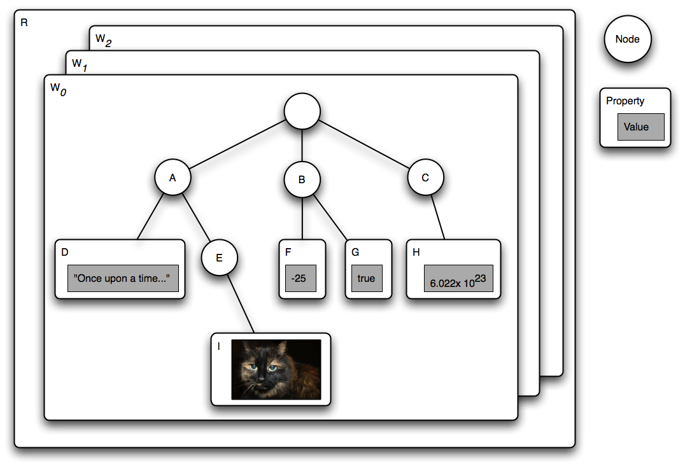
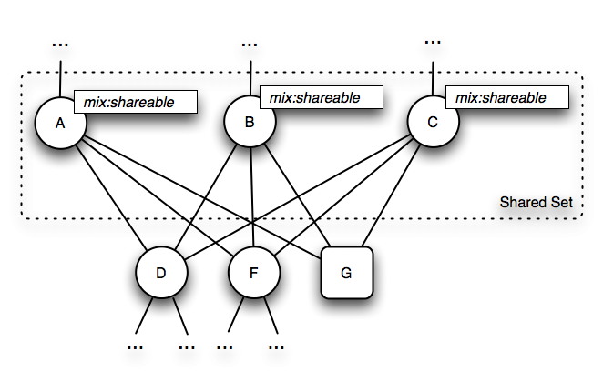
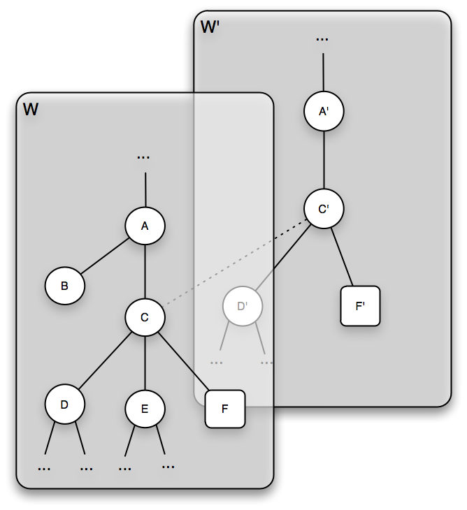
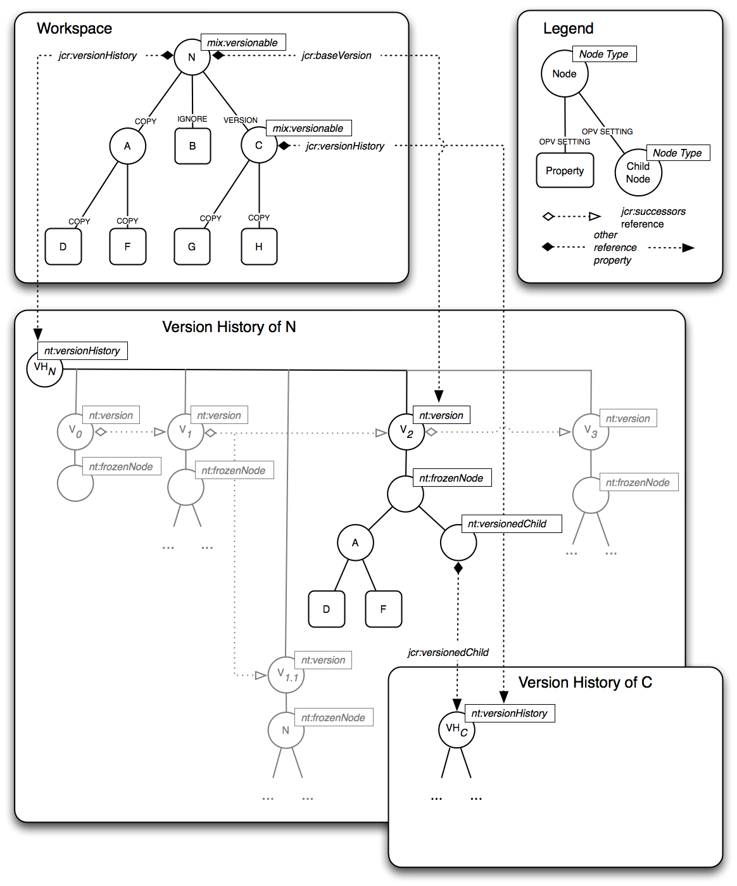
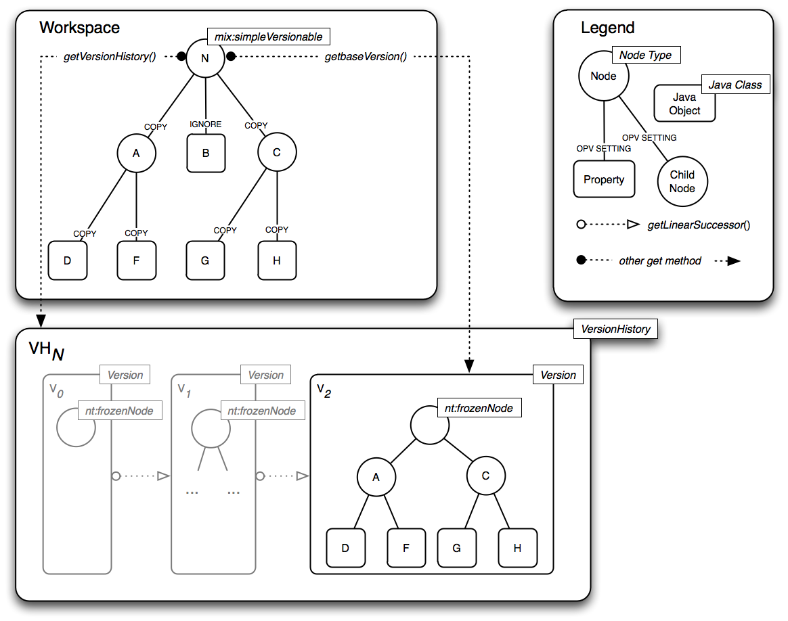
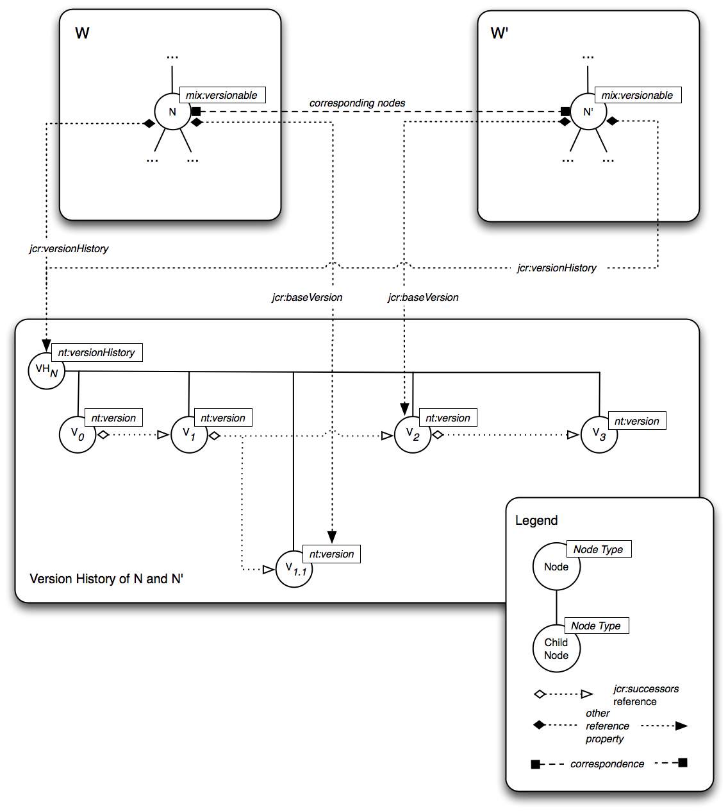

=============================================================================
JCR 2.0: 3 Repository Model (Content Repository for Java Technology API v2.0)
=============================================================================

3 Repository Model
==================

This section describes the objects, types and structures that compose a
JCR repository. The description is language-neutral and focuses on the
static aspects of the data model. Discussion of the behavioral aspects
of the repository, and in particular the Java API for performing
operations on the model, is found in subsequent sections. The full
repository model is described here, though an implementation may support
only a subset of this model, in accordance with §24 \ *Repository
Compliance.*

3.1 Overview
------------

3.1.1 Persistent Workspaces
~~~~~~~~~~~~~~~~~~~~~~~~~~~

A JCR *repository* is composed of one or more *persistent workspaces*,
each consisting of a directed acyclic graph of *items* where the edges
represent the parent-child relation.

Each persistent workspace is identified by a unique name within the
repository, which is a string.

3.1.2 Items
~~~~~~~~~~~

An item is either a *node* or a *property*. A node can have zero or more
child items. A property cannot have child items but can hold zero or
more *values*.

The nodes of a workspace form the structure of the stored data while the
actual content is stored in the values of the properties.

Each workspace contains at least one item, the *root node*. The root
node is the only item in the workspace without a parent node; all other
items have at least one parent.

3.1.2.1 Shared Nodes
^^^^^^^^^^^^^^^^^^^^

In the simplest case, a workspace is a *tree* of items. However,
strictly speaking, the more general term *graph* should be used to cover
those cases where a repository supports the optional *shareable nodes*
feature, which allows an item to have more than one parent (see §3.9
*Shareable Nodes Model*).

3.1.3 Names
~~~~~~~~~~~

The name of the root node of a workspace is always ““ (the empty
string). Every other item in a workspace has a name, which must be a
*JCR name* (see §3.2 *Names*).

3.1.3.1 Same-Name Siblings
^^^^^^^^^^^^^^^^^^^^^^^^^^

In the simplest case, every child item of a given parent has a unique
name. However, child nodes with identical names can only occur if a
repository supports *same-name siblings* (see §22 *Same-Name Siblings*).
Additionally, some repositories may support a node and sibling property
having the same name (see §5.1.8 *Node and Property with Same Name*).
However, two sibling properties can never have the same name.

To distinguish sibling nodes with the same name an integer index,
starting at 1, is used. A node with no same-name siblings has an
implicit index of 1 and a node name without an index is understood to
have an index of 1.

3.1.4 Paths
~~~~~~~~~~~

The location of an item in the workspace graph can be described by the
path from the root node to that item. The path consists of the name (and
index in cases of same-name siblings) of each interceding node in order
from root to target item, much like a file system path. Relative paths
can also be used to describe the location of one item with respect to
another (see §3.4 *Paths*).

3.1.5 Identifiers
~~~~~~~~~~~~~~~~~

In addition to a path, every node also has an identifier. In some
implementations, the identifier may be independent of the path and
provide an identity to the node that is stable across moves within the
workspace. In simpler repositories the identifier may be implemented as
a reflection of the path and therefore not provide any additional
semantics (see §3.3 *Identifiers*).

3.1.6 Property Types
~~~~~~~~~~~~~~~~~~~~

Properties can be either single or multi-valued. Each value has one of
the 12 possible types (see §3.6 *Properties*). These types include
familiar data storage types such as strings, numbers, booleans, binaries
and dates, as well as types that hold pointers to other nodes in the
workspace.

3.1.6.1 Repository Diagram
^^^^^^^^^^^^^^^^^^^^^^^^^^

| T\ |image0|
| he above diagram depicts a repository R with workspaces W\ :sub:`0`,
W1 and W\ :sub:`2`. The item graph of W\ :sub:`1` contains a root node
with child nodes A, B and C. A has a property D of type STRING and a
child node E, which in turn has a property I of type BINARY. B has the
properties F (a LONG) and G (a BOOLEAN). C has a property H of type
DOUBLE.

3.1.7 Node Types
~~~~~~~~~~~~~~~~

Every node has a type. A node’s type The names, types and other
attributes of its child items. Node types can be used to define complex
storage objects consisting of multiple subnodes and properties, possibly
many layers deep.

3.1.8 Sessions
~~~~~~~~~~~~~~

A *user* connects to a repository by passing a set of credentials and
the name of the workspace that the user wishes to access. The repository
returns a *session* which binds the user to the requested persistent
workspace with a level of authorization determined by that user's
credentials. A session is always bound to exactly one persistent
workspace, though a single persistent workspace may be bound to multiple
sessions.

3.1.8.1 User
^^^^^^^^^^^^

A user is any agent bound to a session. This may be a human user, an
external software process, or anything else that holds and controls the
session.

3.1.8.2 Current Session and Workspace
^^^^^^^^^^^^^^^^^^^^^^^^^^^^^^^^^^^^^

Through a session, the user can access, read and write the nodes and
properties of the bound workspace, to the extent allowed by that user's
authorization and the capabilities of the repository. Any object
acquired, directly, or indirectly through a chain of interceding
objects, from a particular session, is said to be within the scope of
that session and any method called on such object is also within the
scope of the same session.

In the context of discussing a particular object or method call, the
session within whose scope that object or method call lies is referred
to as the *current session*, and the workspace to which that session is
bound is referred to as the *current workspace*.

3.2 Names
---------

A *JCR name* is an ordered pair of strings:

(*N*, *L*)

where *N* is a *JCR namespace* and *L* is a *JCR local name*.

3.2.1 Namespaces
~~~~~~~~~~~~~~~~

A *JCR namespace* is either the empty string or a Universal Resource
Identifier\ :sup:``:sup:`2` <#sdfootnote2sym>`__`.

Namespace ::= EmptyString \| Uri

| 

EmptyString ::= /\* The empty string \*/

| 

Uri ::= /\* A URI, as defined in Section 3 in

http://tools.ietf.org/html/rfc3986#section-3 \*/

3.2.2 Local Names
~~~~~~~~~~~~~~~~~

A *JCR local name* is a string that conforms to the grammar below.

LocalName ::= ValidString – SelfOrParent

/\* Any ValidString except SelfOrParent \*/

| 

SelfOrParent ::= '.' \| '..'

| 

ValidString ::= ValidChar {ValidChar}

| 

ValidChar ::= XmlChar – InvalidChar

/\* Any XmlChar except InvalidChar \*/

| 

InvalidChar ::= '/' \| ':' \| '[' \| ']' \| '\|' \| '\*'

| 

| XmlChar ::= /\* Any character that matches the Char production
|  at http://www.w3.org/TR/xml/#NT-Char \*/

| 

/\* See §1.3.1 String Literals in Syntactic Grammars for details

on the interpretation of string literals in this grammar \*/

3.2.3 Use of JCR Names
~~~~~~~~~~~~~~~~~~~~~~

JCR names are used to name items, node types and other entities
throughout the repository.

3.2.3.1 Item Names
^^^^^^^^^^^^^^^^^^

Every item has one JCR name. If the item has more than one parent it has
the same name relative to each, though in most cases an item will have
only one parent (see §3.9 *Shareable Nodes Model*).

3.2.3.2 Paths
^^^^^^^^^^^^^

JCR names are combined into JCR paths which indicate the location of an
item within a workspace either in relation to the root node or relative
to another item in the workspace (see §4.5 *Workspace*).

3.2.3.3 NAME and PATH Values
^^^^^^^^^^^^^^^^^^^^^^^^^^^^

JCR names appear as the values of NAME properties (see §3.6.1.9 *NAME*)
and within the values of PATH properties (see §3.6.1.10 *PATH*).

3.2.3.4 Node Types
^^^^^^^^^^^^^^^^^^

JCR names are used to name node types (see §3.7 *Node Types*).

3.2.3.5 Constants
^^^^^^^^^^^^^^^^^

JCR names are used to identify other types of entities such as
*privileges*, *access control policies* (see §16 *Access Control
Management*), *retention policies*, *holds* (see §20 *Retention and
Hold*), *activities* (see §15.12 *Activities*) and *configurations* (see
§15.13 *Configurations and Baselines*).

3.2.4 Naming Restrictions
~~~~~~~~~~~~~~~~~~~~~~~~~

This definition of *JCR name* represents the *least restrictive* set of
constraints permitted for the naming of items and other entities. A
repository *may* further restrict the names of entities to a subset of
JCR names and in most cases is encouraged to do so.

In a read-only repository, any such restrictions will stem trivially
from the fact that the repository controls the set of entity names
exposed. A writable repository *may* enforce any implementation-specific
constraint by causing an exception to be thrown on an invalid JCR write
method call.

The characters declared invalid within a local name (“/”, “:”, “[“, “]”,
“\|”, “\*”) represent only those characters which are used as
metacharacters in JCR names, paths and name-matching patterns (see
§5.2.2 *Iterating Over Child Items*). These restrictions are not
necessarily sufficient to enforce best practices in the creation of JCR
names. In particular, the minimal grammar defined here permits JCR names
with leading and trailing whitespace as well as characters which may
appear superficially identical while representing different code points,
creating a potential security issue.

Though this specification does not attempt to define good naming
practice, implementers are discouraged from permitting names with these
and other problematic characteristics when possible. However, there may
be cases where the latitude provided by the minimal grammar is useful,
for example, when a JCR implementation is built on top of an existing
data store with an unconventional naming scheme.

3.2.5 Lexical Form of JCR Names
~~~~~~~~~~~~~~~~~~~~~~~~~~~~~~~

While a JCR name is an ordered pair of strings, (*N*, *L*), it is not
itself a string. There are, however, two lexical forms (string
serializations) that a JCR name can take when used in the JCR API: the
*expanded form* and the *qualified form*. A JCR name that is converted
to either lexical form is said to have been *lexicalized*.

3.2.5.1 Expanded Form
^^^^^^^^^^^^^^^^^^^^^

The expanded form of a JCR name is defined as:

ExpandedName ::= '{' Namespace '}' LocalName

| 

Namespace ::= /\* see §3.2.1 Namespaces \*/

| 

LocalName ::= /\* see §3.2.2 Local Names \*/

| 

/\* See §1.3.1 String Literals in Syntactic Grammars for details

on the interpretation of string literals in this grammar \*/

3.2.5.2 Qualified Form
^^^^^^^^^^^^^^^^^^^^^^

The qualified form of a JCR name is defined as:

QualifiedName ::= [Prefix ':'] LocalName

| 

| Prefix ::= /\* Any string that matches the NCName production in
| http://www.w3.org/TR/REC-xml-names \*/

| 

LocalName ::= /\* see §3.2.2 Local Names \*/

| 

/\* See §1.3.1 String Literals in Syntactic Grammars for details

on the interpretation of string literals in this grammar \*/

A qualified name is only interpretable in the context of a *namespace
mapping*, which provides a one-to-one mapping between prefixes and
namespaces.

When a qualified name *Q* is passed to a JCR method within the scope of
the Session *S* then the JCR name *J* represented by *Q* is *(N, L)*
where *N* is the *namespace* corresponding to *P* in the *local
namespace mapping* of *S*. See §3.4 *Namespace Mapping*.

When a qualified name occurs in a string serialization of repository
content or a node type definition, the namespace mapping is either
provided within the serialized form (see, for example, §7 *Export* and
§25.2 *Compact Node Type Definition Notation*) or implied by the context
of use.

3.2.5.3 Qualified Form with the Empty Namespace
^^^^^^^^^^^^^^^^^^^^^^^^^^^^^^^^^^^^^^^^^^^^^^^

The qualified form of a name (““, *L*) (i.e., with the empty string as
namespace) is not written as

:*L*

but simply as

*L*

The former is not a valid qualified JCR name.

3.2.5.4 Exposing Non-JCR Names
^^^^^^^^^^^^^^^^^^^^^^^^^^^^^^

An implementation that exposes a non-JCR data store through the JCR API
may wish to expose names containing JCR-illegal characters by using a
substitution or escaping scheme. If so, it must do so by substituting
private-use Unicode characters for the JCR-illegal characters according
to the following mapping.

+------------------------------+---------------+--------------+--------------+--------------+--------------+---------------+
| **JCR-Illegal character**    | \* (U+002A)   | / (U+002F)   | : (U+003A)   | [ (U+005B)   | ] (U+005D)   | \| (U+007C)   |
|                              |               |              |              |              |              |               |
| **Substitution character**   | U+F02A        | U+F02F       | U+F03A       | U+F05B       | U+F05D       | U+F07C        |
+------------------------------+---------------+--------------+--------------+--------------+--------------+---------------+

| 
| The mapping must be used bi-directionally. When the repository wishes
to return the name of an entity whose native name contains a JCR-illegal
character, that character must be replaced with its corresponding
substitution character in the returned string.

Conversely, when a name containing one of the substitution characters is
passed to the repository through the JCR API, that character must be
replaced with its corresponding non-JCR character before further
processing is done within the native layer, whether writing the name to
storage or using the name to access an entity.

In the unlikely event that one of the substitution characters appears
literally in a native name, that character will be returned unchanged
through the JCR API.

In repositories that do not expose non-JCR names and therefore do not
need to use the substitution scheme, any private-use substitution
character passed to the API is stored and returned unchanged. However,
such use of a private-use substitution character within a JCR name is
strongly discouraged.

3.2.6 Use of Qualified and Expanded Names
~~~~~~~~~~~~~~~~~~~~~~~~~~~~~~~~~~~~~~~~~

When a JCR name is passed as an argument to a JCR method it may be in
either expanded or qualified form. When a repository returns a JCR name
it must be in qualified form. The qualified form of a name depends upon
the prevailing local namespace mapping of the current session (see §3.5
*Namespace Mapping*).

3.2.7 Equality of Names
~~~~~~~~~~~~~~~~~~~~~~~

Two JCR names (*N*\ :sub:`*1*`, *L*\ :sub:`*1*`) and (*N*\ :sub:`*2*`,
*L*\ :sub:`*2*`) are *equal* if and only if *N*\ :sub:`*1*` is equal to
*N*\ :sub:`*2*` and *L*\ :sub:`*1*` is equal to *L*\ :sub:`*2*`,
according to the definition of string equality used in the
String.compareTo method. This definition applies both in the general
context of using an API method that takes or returns a JCR name and in
the specific case of comparing values of type NAME (see §3.6.5.8
*NAME*).

3.3 Identifiers
---------------

Every node has an *identifier*. An identifier is a string whose format
is not defined by this specification but which adheres to the following
constraints:

-  The identifier of a non-shared node is unique within a workspace. The
   identifier of a shared node is common to each member of that node's
   share-set (see §3.9 *Shareable Nodes Model*).

-  An identifier *must* be the most stable one available to the
   implementation. For example, in some implementations this might be
   nothing more than the node path itself. Other implementations might
   support node identifiers that are partly or entirely independent of
   the path.

3.3.1 Identifier Assignment
~~~~~~~~~~~~~~~~~~~~~~~~~~~

The identifier must be assigned at the latest when the node is first
persisted, though it may be assigned earlier, when the node is first
created in transient storage in the session (see §10.4.1 *Adding a
Node*).

3.3.2 Referenceable Identifiers
~~~~~~~~~~~~~~~~~~~~~~~~~~~~~~~

In implementations that support referenceable nodes, these nodes have
more stringent requirements on their identifiers (see §3.8
*Referenceable Nodes*).

3.3.3 Correspondence by Identifier
~~~~~~~~~~~~~~~~~~~~~~~~~~~~~~~~~~

Identifiers are also used for *node correspondence* across multiple
workspaces (see §3.10 *Corresponding Nodes*).

3.4 Paths
---------

A *JCR path* *P*,

*P* = (*S*\ :sub:`*0*`, *S*\ :sub:`*1*`, ..., *S*\ :sub:`*n*`),

is an ordered list with at least one element, where each element
*S*\ :sub:`*i*`, for 0  *i*  n, is a *path segment*.

3.4.1 Path Segment
~~~~~~~~~~~~~~~~~~

A path segment is one of:

-  | a *name segment*, (*J*, *I*), where *J* is a JCR name and
   | *I* is an integer index (*I* ≥ 1).

-  an *identifier segment*, *U*, where *U* is a JCR identifier.

-  the *root segment*.

-  the *self segment*.

-  the *parent segment*.

The root, self and parent segments are logical constants distinct from
each other and from all name segments.

3.4.1.1 Position of Segments in a Path
^^^^^^^^^^^^^^^^^^^^^^^^^^^^^^^^^^^^^^

Name, self and parent segments can occur at any position in a path.

A root segment can occur only as the first segment of a path.

An identifier segment can occur only as the first and sole segment in a
path. No other segments may follow an identifier segment.

3.4.2 Path Resolution
~~~~~~~~~~~~~~~~~~~~~

The successive path segments of JCR path *P* = (*S*\ :sub:`*0*`,
*S*\ :sub:`*1*`, ..., *S*\ :sub:`*n*`) define a route through workspace
*W* to a *target* item as follows:

-  If *S*\ :sub:`*0*` is the root segment then the path is absolute and
   the *current* item is the root node of *W*.

-  If *S*\ :sub:`*0*` is an identifier segment *U*, then the path is
   absolute and the *current* item is the node in *W* with the
   identifier *U*.

-  Otherwise, the path is relative and the *current* item is determined
   by the context of use.

-  For each segment *S* in path *P*:

   -  If *S* is a self segment then the *current* item does not change.

   -  If *S* is a parent segment then the new *current* item is a parent
      of the old *current* item (see §3.4.2.1 *Parent Resolution*).

   -  If *S* is a name segment then the new current item is the child of
      the old *current* item identified by *S* (see §3.4.2.2 *Child
      Resolution*).

-  Once all segments have been traversed, the *current* item is the
   *target* item.

3.4.2.1 Parent Resolution
^^^^^^^^^^^^^^^^^^^^^^^^^

In most cases an item will have only one parent, in such a case, parent
resolution is trivial. In repositories that support shareable nodes, a
node may share its child nodes and properties with other nodes. A child
item of a shared node therefore has more than one parent. In such a case
the parent resolved depends upon the *deemed path* of the item, which is
an implementation-specific issue (see §3.9.5 *Deemed Path*). An attempt
to resolve the parent of a workspace root node always fails.

3.4.2.2 Child Resolution
^^^^^^^^^^^^^^^^^^^^^^^^

Given a name segment *S* = (*J*, *I*), *J* is the name of the child item
indicated by that segment while *I* indicates the index of the item. The
index is an integer greater than or equal to 1 and is used to
distinguish between sibling child nodes with the same name. If there is
only one child node with the name *J* then its index is always 1. If
there is more than one node with the name *J* then each has a unique
index (see §22 *Same-Name Siblings*).

The child item indicated by *S* is determined as follows:

-  If the *S* *is not* the last segment of the path then, if a child
   node with name *J* and index *I* exists, *S* resolves to that node.
   Otherwise, resolution fails.

-  If *S* *is* the last segment of the path then,

-  if *S* is constrained to resolve to a *gettable node* (as in the case
   of Node.getNode) and a child node with name *J* and index *I* is
   retrievable, *S* resolves to that node. Otherwise,

-  if *S* is constrained to resolve to an *addable node* (as in the case
   of Node.addNode) and a child node named *J* can be legally added and
   *I* is equal to 1, then *J* is used as the name of the new node
   which, if necessary, is given an appropriate index. Otherwise,

-  if *S* is constrained to resolve to a *gettable property* (as in the
   case of Node.getProperty) then, if a property with name *J* is
   retrievable, and *I* is equal to 1, *S* resolves to that property.
   Otherwise,

-  if *S* is constrained to resolve to a *settable property* (as in the
   case of Node.setProperty) then, if a property with name *J* or if a
   property named *J* can be legally added, and *I* is equal to 1, *S*
   resolves to that property. Otherwise,

-  if *S* is constrained to resolve to a *gettable item* (as in the case
   of Session.getItem) then if a node with name *J* and index *I* is
   retrievable, *S* resolves to that node. Otherwise, if there exists a
   property with name J and *I* is equal to 1, then *S* resolves to that
   property.

-  Otherwise, resolution fails.

3.4.3 Lexical Forms
~~~~~~~~~~~~~~~~~~~

Given a JCR path P = (S0, S1, ..., Sn), its lexical form L can be
constructed according to the following algorithm, where = is the
assignment operator, += is the string append operator, or indicates an
arbitrary choice between alternative operations and nothing is the null
operation.

L = ""

for each S in P

if S is the root segment **

L += "/"

else

if S is an identifier segment U

L += "[" + U + "]"

else if S is a self segment

L += "."

else if S is a parent segment

L += ".."

else if S is a name segment (J, I)

L += the qualified form of J

or L += the expanded form of J *//optional syntax*

if I > 1

L += "[" + I + "]"

else

nothing

or L += "[1]" *//optional syntax*

end if

end if

if S is not the last segment of P

L += "/"

else

nothing

or L += "/" *//optional syntax*

end if

end if

end for

The resulting L is a lexical form of P. As indicated by the steps marked
*optional syntax*, a JCR path may have multiple equivalent lexical forms
depending on the use of qualified vs. expanded names, the optional [1]
index indicator and the optional trailing forward slash (“/”).

3.4.3.1 Standard Form
^^^^^^^^^^^^^^^^^^^^^

A string constructed without any of the optional syntax shown in the
algorithm is called the *standard form* of a JCR path. Such a lexical
path has the following characteristics:

-  It consists of either one identifier segment or one or more name
   segments.

-  All name segments are in qualified form, none are in expanded form.

-  No name segment has a [1] index.

-  There is no trailing forward slash (“/”).

The following are examples of standard form lexical paths:

-  /

-  /ex:document

-  /ex:document/ex:paragraph[2]

-  [f81d4fae-7dec-11d0-a765-00a0c91e6bf6]

3.4.3.2 Non-Standard Form
^^^^^^^^^^^^^^^^^^^^^^^^^

A string constructed *with one or more optional steps* is a
*non-standard form* JCR path. A non-standard form lexical path has *at
least one* of the following features:

-  One or more name segments are in expanded form.

-  One or more name segments has a [1] index.

-  The path has a trailing forward slash (“/”).

The following are examples of non-standard form lexical paths:

-  /ex:document[1]

-  /ex:document/

-  /{http://example.com/ex}document/ex:paragraph[2]

3.4.3.3 Lexical Path Grammar
^^^^^^^^^^^^^^^^^^^^^^^^^^^^

A JCR path in lexical form conforms to the following grammar

Path ::= AbsolutePath \| RelativePath

| 

AbsolutePath ::= '/' [RelativePath] \| '[' Identifier ']'

| 

RelativePath ::= [RelativePath '/'] PathSegment ['/']

| 

| PathSegment ::= ExpandedName [Index] \|
|  QualifiedName [Index] \|

SelfOrParent

| 

Index ::= '[' Number ']'

| 

Identifier ::= /\* See §3.3 Identifiers \*/

| 

Number ::= /\* An integer > 0 \*/

| 

ExpandedName ::= /\* See §3.2.5.1 Expanded Form \*/

QualifiedName ::= /\* See §3.2.5.2 Qualified Form \*/

| 

SelfOrParent ::= /\* see §3.2.2 Local Names \*/

| 

/\* See §1.3.1 String Literals in Syntactic Grammars for details

on the interpretation of string literals in this grammar \*/

3.4.3.4 Parsing Lexical Paths
^^^^^^^^^^^^^^^^^^^^^^^^^^^^^

When parsing a lexical path, the parser must distinguish between name
segments that are in expanded form and those that are in qualified form
(see §3.2.5 *Lexical Form of JCR Names*). When making this
determination, the repository cannot assume that every namespace URI
encountered in an expanded name will be registered within the
repository.

An otherwise valid path containing an expanded name with an unregistered
*namespace URI* will always resolve into a valid internal representation
of a path (i.e., an ordered list of path segments, see §3.4 *Paths*).
Any errors that arise from passing such a path must therefore be as a
result of further processing (not merely parsing) that depends on the
semantics of the path and the context of use.

However, a path containing a qualified name with an unregistered
*prefix* will *not* resolve into a valid internal path representation.
An attempt to pass such a path will therefore fail at the parsing stage.

3.4.4 Absolute and Relative Paths
~~~~~~~~~~~~~~~~~~~~~~~~~~~~~~~~~

An abstract JCR path is either *absolute* or *relative*.

3.4.4.1 Absolute Path
^^^^^^^^^^^^^^^^^^^^^

An absolute JCR path is either *root-based* or *identifier-based*.

3.4.4.1.1 Root-Based Absolute Paths
'''''''''''''''''''''''''''''''''''

A root-based absolute path begins with the root segment. Its lexical
form therefore begins with a forward slash, for example,

/A/B/C

3.4.4.1.2 Identifier-Based Absolute Paths
'''''''''''''''''''''''''''''''''''''''''

An identifier-based absolute path consists of a single identifier
segment. Its lexical form therefore consists of square brackets
delimiting an identifier, for example,

[f81d4fae-7dec-11d0-a765-00a0c91e6bf6]

3.4.4.2 Relative Path
^^^^^^^^^^^^^^^^^^^^^

A relative JCR path is one which begins with a segment that is neither a
root segment nor an identifier segment. Its lexical form therefore
begins with either a JCR name, .. or ., for example,

D/E/F

or

../E/F/G

3.4.5 Normalized Paths
~~~~~~~~~~~~~~~~~~~~~~

A JCR path is normalized by the following steps:

-  All self segments are removed.

-  All redundant parent segments are collapsed. A redundant parent
   segment is one which can be removed by also removing a preceding name
   segment while preserving the location indicated by the path. For
   example, the path /A/B/C/../.. can be collapsed to /A. Note
   therefore, that if a normalized path contains any parent segments,
   they must all precede the first name segment.

-  If the path is an identifier-based absolute path, it is replaced by a
   root-based absolute path that picks out the same node in the
   workspace as the identifier it replaces.

3.4.6 Passing Paths
~~~~~~~~~~~~~~~~~~~

When a JCR path is passed as an argument to a JCR method it may be
normalized or non-normalized and in standard or non-standard form.

3.4.7 Returning Paths
~~~~~~~~~~~~~~~~~~~~~

When a repository returns a JCR path it must be normalized (see §3.4.5
*Normalized Paths*), unless the repository is returning the value of a
PATH property, in which case the original, possibly non-normalized form
of the path is preserved and returned. In all cases the returned path
must be in standard form (see §3.4.3.1 *Standard Form*).

3.4.8 Equality of Paths
~~~~~~~~~~~~~~~~~~~~~~~

Two types of path equality are defined: *segment equality* and *semantic
equality*.

3.4.8.1 Segment Equality
^^^^^^^^^^^^^^^^^^^^^^^^

Two paths *P*\ :sub:`*1*` and *P*\ :sub:`*2*` are segment-equal if and
only if:

-  They contain the same number of segments.

-  Each segment in *P*\ :sub:`*1*` is equal to the segment at the same
   position in *P*\ :sub:`*2*`.

Two name segments are equal if and only if their JCR names are equal
(see §3.2.7 *Equality of Names*) and their integer indexes are equal.

Equality for identifier segments is as defined for identifiers in
general, that is, by standard Java String equality.

Equality for root, self and parent segments is simple type identity;
every instance of a root, parent or self segment is equal to every other
instance of the same type.

3.4.8.2 Semantic Equality
^^^^^^^^^^^^^^^^^^^^^^^^^

For two paths *P*\ :sub:`*1*` ** and *P*\ :sub:`*2*` semantic equality
is defined as follows:

-  If *P*\ :sub:`*1*` and *P*\ :sub:`*2*` are normalized then they are
   semantically equal if and only if they are *segment-equal.*

-  If *P*\ :sub:`*1*` and *P*\ :sub:`*2*` are non-normalized then they
   are semantically equal if and only if their normalized forms are
   semantically equal.

3.4.8.3 Application of Path Equality
^^^^^^^^^^^^^^^^^^^^^^^^^^^^^^^^^^^^

When a JCR path is passed to a JCR API method that must resolve that
path the applicable definition of path equality is that of semantic
equality. Semantic equality of two paths means that, given identical
contexts, the two paths will resolve to the same item.

However, values of type PATH are not normalized upon storage or
retrieval, so the when comparing two such values, the applicable
definition of equality is that of segment equality. (see §3.6.5.9
*PATH*).

3.5 Namespace Mapping
---------------------

For compactness and legibility in documentation, XML and Java code, JCR
names are usually expressed in qualified form.

The use of qualified form, however, depends upon a context that supplies
a mapping from prefix to namespace. In documentation this context is
provided either by convention or explicit statement. In XML
serialization it is supplied by xmlns attributes (see §7 *Export*) and
in a running JCR repository is provided by the local namespace mapping
of each individual Session.

3.5.1 Namespace Registry
~~~~~~~~~~~~~~~~~~~~~~~~

The local namespace mapping of a session is determined by the initial
set of mappings copied from the *namespace registry* and any
session-local changes made to that set.

The namespace registry is a single, persistent, repository-wide table
that contains the default namespace mappings. It may contain namespaces
that are not used in repository content, and there may be repository
content with namespaces that are not included in the registry. The
namespace registry always contains at least the following built-in
mappings between prefix (on the left) and namespace (on the right):

#. | jcr = http://www.jcp.org/jcr/1.0
   | Reserved for items defined within built-in node types (see §3.7
   *Node Types*).

#. | nt = http://www.jcp.org/jcr/nt/1.0
   | Reserved for the names of built-in primary node types.

#. | mix = http://www.jcp.org/jcr/mix/1.0
   | Reserved for the names of built-in mixin node types.

#. | xml = http://www.w3.org/XML/1998/namespace
   | Reserved for reasons of compatibility with XML.

#. *(the empty string)* = *(the empty string)
   *\ The default namespace is the *empty namespace*.

3.5.1.1 Empty Prefix and Empty Namespace
^^^^^^^^^^^^^^^^^^^^^^^^^^^^^^^^^^^^^^^^

The permanent default namespace in JCR is the empty string, also
referred to as the *empty namespace*. This permanence is reflected in
the immutable default namespace mapping in the namespace registry. By
definition, the prefix in this mapping is the empty string, also
referred to as the *empty prefix*.

3.5.1.2 Additional Built-in Namespaces
^^^^^^^^^^^^^^^^^^^^^^^^^^^^^^^^^^^^^^

A repository may provide additional built-in mappings other than those
defined in this section. All mappings must be one-to-one, meaning that
for a given namespace in the registry exactly one prefix is mapped to
it, and for a given prefix in the registry exactly one namespace is
mapped to it.

3.5.2 Session-Local Mappings
~~~~~~~~~~~~~~~~~~~~~~~~~~~~

A local set of namespace mappings is associated with each session. When
a new session is acquired, the mappings present in the persistent
namespace registry are copied to the local namespace mappings of that
session. A user can then add new mappings or change existing ones. The
resulting mapping table applies only within the scope of that session
(see §5.11 *Namespace Mapping*).

If a JCR method returns a name from the repository with a namespace URI
for which no local mapping exists, a prefix is created automatically and
a mapping between that prefix and the namespace URI in question is added
to the set of local mappings. The new prefix must differ from those
already present among the set of local mappings. If a JCR method is
passed a name or path containing a prefix which does not exist in the
local mapping an exception is thrown.

3.5.2.1 Effect of Session Namespace Mappings
^^^^^^^^^^^^^^^^^^^^^^^^^^^^^^^^^^^^^^^^^^^^

All methods that take or return names or paths must use the current
session (see §3.1.8.2 *Current Session and Workspace*) namespace
mappings to dynamically interpret or produce those names or paths
according to the current local namespace mapping of the current session.

Though the precise mechanism of this behavior is an implementation
detail, its behavior must be equivalent to that of a system where names
and paths are stored internally in expanded form and converted
dynamically to and from qualified JCR names or paths as necessary.

3.5.3 Namespace Conventions
~~~~~~~~~~~~~~~~~~~~~~~~~~~

Names and paths determined by an application provider should be assigned
namespace URIs under the control of the provider organization. Because
the space of URIs is universally managed, this ensures that naming
collisions will not occur between applications from providers that
observe this convention.

3.6 Properties
--------------

All data stored within a JCR repository is ultimately stored as the
values of properties.

3.6.1 Property Types
~~~~~~~~~~~~~~~~~~~~

Every property is of one of the following types: STRING, URI, BOOLEAN,
LONG, DOUBLE, DECIMAL, BINARY, DATE, NAME, PATH, WEAKREFERENCE or
REFERENCE.

3.6.1.1 STRING
^^^^^^^^^^^^^^

STRING properties store instances of java.lang.String.

3.6.1.2 URI
^^^^^^^^^^^

URI properties store instances of java.lang.String that conform to the
syntax of a URI-reference as defined in RFC
3986\ :sup:``:sup:`3` <#sdfootnote3sym>`__`.

3.6.1.3 BOOLEAN
^^^^^^^^^^^^^^^

BOOLEAN properties store instances of the Java primitive type boolean.

3.6.1.4 LONG
^^^^^^^^^^^^

LONG properties store instances of the Java primitive type long.

3.6.1.5 DOUBLE
^^^^^^^^^^^^^^

DOUBLE properties store instances of the Java primitive type double.

3.6.1.6 DECIMAL
^^^^^^^^^^^^^^^

DECIMAL properties store instances of java.math.BigDecimal.

3.6.1.7 BINARY
^^^^^^^^^^^^^^

BINARY properties store instances of javax.jcr.Binary (see §5.10.5
*Binary Object*).

3.6.1.8 DATE
^^^^^^^^^^^^

DATE properties store instances of java.util.Calendar. Note that an
implementation may not support DATE values that cannot be represented in
the ISO 8601-based notation defined in §3.6.4.3 *From DATE To*. In such
cases an attempt to set a property to such a value will throw a
ValueFormatException.

3.6.1.9 NAME
^^^^^^^^^^^^

NAME properties store instances of JCR names.

3.6.1.10 PATH
^^^^^^^^^^^^^

PATH properties store instances of JCR paths and serve as pointers to
locations within the workspace. PATH properties *do not* enforce
referential integrity.

3.6.1.11 WEAKREFERENCE
^^^^^^^^^^^^^^^^^^^^^^

WEAKREFERENCE properties serve as pointers to referenceable nodes by
storing their identifiers. WEAKREFERENCE properties *do not* enforce
referential integrity (see §3.8.2 *Referential Integrity*).

3.6.1.12 REFERENCE
^^^^^^^^^^^^^^^^^^

REFERENCE properties serve as pointers to referenceable nodes by storing
their identifiers. REFERENCE properties *do* enforce referential
integrity (see §3.8.2 *Referential Integrity*).

3.6.2 Undefined Type
~~~~~~~~~~~~~~~~~~~~

The UNDEFINED keyword, while not specifying an actual type, may be
supported by some repositories as a valid property type attribute value
in property definitions within node types. In that context it indicates
that the specified property may be of *any* type. No actual existing
property in the repository ever has the type UNDEFINED.

3.6.3 Single and Multi-Value Properties
~~~~~~~~~~~~~~~~~~~~~~~~~~~~~~~~~~~~~~~

A property may be a single-value or a multi-value property.

A single-value property, if it exists, must have a value. There is no
such thing as a null value. A multi-value property can have zero or more
values. Again there is no such thing as a null value, however a
multi-value property can be empty, just as an array can be empty.

The values stored within a multi-valued property are all of the same
type and are ordered.

Whether a particular property is a multi-valued property is governed by
the property definition applicable to it, which is determined by the
node type of the property's parent node (see §3.7 *Node Types*).

Accessing the value of a property is done with Property.getValue which
returns a single Value object. Accessing the set of values of a
multi-value property is done through Property.getValues which returns a
(possibly empty) array of Value objects (see §5.10 *Reading
Properties*).

3.6.4 Property Type Conversion
~~~~~~~~~~~~~~~~~~~~~~~~~~~~~~

When the value of a property is read or written using a type different
from that declared for the property, the repository attempts a type
conversion according to the following rules. Note that even in cases
where the JCR type conversion is defined in terms of standard JDK type
conversion method, failure of conversion must only ever cause a JCR
ValueFormatException to be thrown and never any exception defined in the
JDK API.

3.6.4.1 From STRING To
^^^^^^^^^^^^^^^^^^^^^^

**BINARY**: The string is encoded using UTF-8.

**DATE**: If the string is in the format described in §3.6.4.3 *From
DATE To*, it is converted directly, otherwise a ValueFormatException is
thrown.

**DOUBLE**: The string is converted using
java.lang.Double.valueOf(String).

**DECIMAL**: The string is converted using the constructor
java.math.BigDecimal(String).

**LONG**: The string is converted using java.lang.Long.valueOf(String).

**BOOLEAN**: The string is converted using
java.lang.Boolean.valueOf(String).

**NAME**: If the string is a syntactically valid qualified JCR name with
a registered prefix, it is converted directly. If it is a syntactically
valid expanded JCR name with a registered namespace URI, it is returned
in qualified form. If it is a syntactically valid expanded JCR name with
an *unregistered* namespace URI, a prefix is created automatically, the
mapping added to the local namespace mappings (see §3.5.2 *Session-Local
Mappings*), and the name is returned in qualified form. Otherwise a
ValueFormatException is thrown.

**PATH**: If the string is a valid JCR path then each name segment is
converted as per NAME conversion above, and all other segments are
converted directly. If one or more name conversions fails or if the
string is not a valid path then a ValueFormatException is thrown. The
presence of an item in the current workspace at that path is not
required.

**URI**: If the string is a syntactically valid URI-reference, it is
converted directly, otherwise a ValueFormatException is thrown. The
string is parsed as described in RFC 3986. In particular, the first
colon (“:”) encountered is interpreted as the scheme delimiter and the
string as a whole is assumed to already be in percent-encoded form. This
means that if a non-URI-legal character is encountered it is not
percent-encoded, but is instead regarded as an error and a
ValueFormatException is thrown.

**REFERENCE or WEAKREFERENCE**: If the string is a syntactically valid
identifier, according to the implementation, it is converted directly,
otherwise a ValueFormatException is thrown. The identifier is not
required to be that of an existing node in the current workspace.

3.6.4.2 From BINARY To
^^^^^^^^^^^^^^^^^^^^^^

**STRING**: An attempt is made to interpret the stream as a UTF-8
encoded string. If the string is not a legal UTF-8 byte sequence then
the behavior is implementation-specific.

**All Others**: The binary stream is first converted to a string, as
described above. If this is successful, the resulting string is
converted according to the appropriate conversion as described in
§3.6.4.1 *From STRING To*.

3.6.4.3 From DATE To
^^^^^^^^^^^^^^^^^^^^

**STRING**: The date is converted to the following format:

*sYYYY*-*MM*-*DD*\ T\ *hh*:*mm*:*ss*.\ *sssTZD*

where:

| sYYYY
| Four-digit year with optional leading positive (‘+’) or negative (‘-’)
sign. 0000 , -0000 and +0000 all indicate the year 1 BCE. –YYYY where
YYYY is the number *y* indicates the year (*y*\ +1) BCE. The absence of
a sign or the presence of a positive sign indicates a year CE. For
example, -0054 would indicate the year 55 BCE, while +1969 and 1969
indicate the year 1969 CE.

| MM
| Two-digit month (01 = January, etc.)

| DD
| Two-digit day of month (01 through 31)

| hh
| Two digits of hour (00 through 23, or 24 if mm is 00 and ss.sss is
00.000)

| mm
| Two digits of minute (00 through 59)

| ss.sss
| Seconds, to three decimal places (00.000 through 59.999 or 60.999 in
the case of leap seconds)

| TZD
| Time zone designator (either *Z* for Zulu, i.e. UTC, or *+hh:mm* or
*-hh:mm*, i.e. an offset from UTC)

Note that the “T” separating the date from the time and the separators
“-”and “:” appear literally in the string.

This format is a subset of the format defined by ISO 8601:2004.

If the DATE value cannot be represented in this format a
ValueFormatException is thrown.

**BINARY**: The date is converted to a string, as described in §3.6.4.2
*From BINARY To*, and this string is encoded in UTF-8.

**DOUBLE**: The date is converted to the number of milliseconds since
00:00 (UTC) 1 January 1970 (1970-01-01T00:00:00.000Z). If this number is
out-of-range for a double, a ValueFormatException is thrown.

**DECIMAL**: The date is converted to the number of milliseconds since
00:00 (UTC) 1 January 1970 (1970-01-01T00:00:00.000Z).

**LONG**: The date is converted to the number of milliseconds since
00:00 (UTC) 1 January 1970 (1970-01-01T00:00:00.000Z). If this number is
out-of-range for a long, a ValueFormatException is thrown.

**All Others**: A ValueFormatException is thrown.

Since the string and number formats into which a DATE may be converted
can hold only a subset of the information potentially contained within a
java.util.Calendar, conversion from DATE to STRING, BINARY, DOUBLE,
DECIMAL or LONG may result in loss of information.

3.6.4.4 From DOUBLE To
^^^^^^^^^^^^^^^^^^^^^^

**STRING**: The double is converted using java.lang.Double.toString().

**BINARY**: The double is converted to a string, as described in
§3.6.4.2 *From BINARY To*, and this string is encoded in UTF-8.

**DECIMAL**: The double is converted using the constructor
java.math.BigDecimal(double).

**DATE**: The double is coerced to a long using standard Java type
coercion and interpreted as the number of milliseconds since 00:00 (UTC)
1 January 1970 (1970-01-01T00:00:00.000Z). If the resulting value is out
of range for a date, a ValueFormatException is thrown.

**LONG**: Standard Java type coercion is used.

**All Others**: A ValueFormatException is thrown.

3.6.4.5 From DECIMAL To
^^^^^^^^^^^^^^^^^^^^^^^

**STRING**: The decimal is converted using
java.math.BigDecimal.toString().

**BINARY**: The decimal is converted to a string, as described in
§3.6.4.2 *From BINARY To*, and this string is encoded in UTF-8.

**DOUBLE**: The decimal is converted using
java.math.BigDecimal.doubleValue().

**DATE**: The decimal is converted to a long and interpreted as the
number of milliseconds since 00:00 (UTC) 1 January 1970
(1970-01-01T00:00:00.000Z). If the resulting value is out of range for a
date, a ValueFormatException is thrown.

**LONG**: The decimal is converted using
java.math.BigDecimal.longValue().

**All Others**: A ValueFormatException is thrown.

3.6.4.6 From LONG To
^^^^^^^^^^^^^^^^^^^^

**STRING**: The long is converted using java.lang.Long.toString().

**BINARY**: The long is converted to a string, as described in §3.6.4.2
*From BINARY To*, and this string is encoded in UTF-8.

**DECIMAL**: The double is converted using the method
java.math.BigDecimal.valueOf(long).

**DATE**: The long is interpreted as the number of milliseconds since
00:00 (UTC) 1 January 1970 (1970-01-01T00:00:00.000Z). If the resulting
value is out of range for a date, a ValueFormatException is thrown.

**DOUBLE**: Standard Java type coercion is used.

**All Others**: A ValueFormatException is thrown.

3.6.4.7 From BOOLEAN To
^^^^^^^^^^^^^^^^^^^^^^^

**STRING**: The boolean is converted using java.lang.Boolean.toString().

**BINARY**: The boolean is converted to a string, as described in
§3.6.4.2 *From BINARY To*, and this string is encoded in UTF-8.

**All Others**: A ValueFormatException is thrown.

3.6.4.8 From NAME To
^^^^^^^^^^^^^^^^^^^^

**STRING**: The name is converted to qualified form according to the
current local namespace mapping (see §3.2.5.2 *Qualified Form*).

**BINARY**: The name is converted to a string, as described in §3.6.4.2
*From BINARY To*, and then encoded using UTF-8.

**PATH**: The name becomes a relative path of length one.

**URI**: The name becomes a URI-reference consisting of “./” followed by
the name in qualified form. For example, the name foo:bar becomes the
URI-reference ./foo:bar. The addition of the leading “./” is done to
ensure that a colon-delimited prefix is not interpreted as a URI scheme
name. If the name includes characters that are illegal within a
URI-reference (such as any non-ASCII character), the UTF-8 byte
representations of these characters are percent-encoded, as described in
RFC 3986\ :sup:``:sup:`4` <#sdfootnote4sym>`__`.

**All Others**: A ValueFormatException is thrown.

3.6.4.9 From PATH To
^^^^^^^^^^^^^^^^^^^^

**STRING**: Each path is converted to standard form according to the
current local namespace mapping (see §3.4.3.1 *Standard Form*).

**BINARY**: The path is converted to a string, as described in §3.6.4.2
*From BINARY To*, and then encoded using UTF-8.

**NAME**: If the path is a relative path of length one it is converted
directly, otherwise a ValueFormatException is thrown.

**URI**: If the path is root-based absolute (that is, it has a leading
“/”, see §3.4.4.1.1 *Root-Based Absolute Paths*), it is directly
converted into a URI-reference. If the path is identifier-based absolute
(§3.4.4.1.2 *Identifier-Based Absolute Paths*) or relative, it becomes a
URI-reference consisting of “./” followed by the path in standard form.
For example, the path foo:bar/foo:baz becomes the URI-reference
./foo:bar/foo:baz. The addition of the leading “./” is done to ensure
that a colon-delimited prefix is not interpreted as a URI scheme name.
If the path includes characters that are illegal within a URI-reference
(such as any non-ASCII character), the UTF-8 byte representations of
these characters are percent-encoded, as described in RFC
3986\ :sup:`6`.

**All Others**: A ValueFormatException is thrown.

3.6.4.10 From URI To
^^^^^^^^^^^^^^^^^^^^

**STRING**: The URI is converted directly into a STRING.

**BINARY**: Since a URI is guaranteed to already contain only ASCII
characters it is converted directly to a BINARY resulting in series of
octets that is a UTF-8 encoding of the character sequence comprising the
URI.

**NAME**: If the URI consists of a single path segment without a colon
(for example, simply bar) it is converted to a NAME by decoding any
percent-escaped sequences into octet sequences and then decoding those
into character sequences using UTF-8. If it has a redundant leading “./”
followed by a single segment (with or without a colon, like ./bar or
./foo:bar ) the redundant “./” is removed and the remainder is converted
to a NAME in the same way. Otherwise a ValueFormatException is thrown.

**PATH**: If the URI begins with a “/” it is converted a PATH by
decoding any percent-escaped sequences into octet sequences and then
decoding those into character sequences using UTF-8. If it consists of a
path whose first segment is without a colon (for example, bar, bar/baz
or bar/foo:baz) it is converted in the same way. If it consists of a
path with a redundant leading “./” (for example ./bar/baz, or
./foo:bar/foo:baz ) the redundant “./” is removed and the remainder is
converted to a PATH as described in §3.6.4.1 *From STRING To*. Otherwise
a ValueFormatException is thrown.

**All Others**: A ValueFormatException is thrown.

3.6.4.11 From REFERENCE To
^^^^^^^^^^^^^^^^^^^^^^^^^^

**STRING**: The identifier is converted directly to a string.

**BINARY**: The identifier is converted directly to a string and then
converted to BINARY as described in §3.6.4.1 *From STRING To*.

**WEAKREFERENCE**: The REFERENCE is simply turned into a WEAKREFERENCE.

**All Others**: A ValueFormatException is thrown.

3.6.4.12 From WEAKREFERENCE To
^^^^^^^^^^^^^^^^^^^^^^^^^^^^^^

**STRING**: The identifier is converted directly to a string.

**BINARY**: The identifier is converted directly to a string and then
converted to BINARY as described in §3.6.4.1 *From STRING To*.

**REFERENCE**: The WEAKREFERENCE is simply turned into a REFERENCE.

**All Others**: A ValueFormatException is thrown.

3.6.5 Comparison of Values
~~~~~~~~~~~~~~~~~~~~~~~~~~

For any values *V*\ :sub:`*1*` and *V*\ :sub:`*2*` both of the same
property type, the relations *is equal to*, *is ordered before* and *is
ordered after* are defined in §3.6.5.1 *CompareTo Semantics*.

Note that the definition of these relations here does not necessarily
imply that JCR API methods for testing these relations are supported for
every property type. In particular, Value.equals is not required to work
on BINARY values and JCR query is not required to support testing the
equality or ordering of BINARY values.

3.6.5.1 CompareTo Semantics
^^^^^^^^^^^^^^^^^^^^^^^^^^^

For the property types *other than* BOOLEAN, NAME, PATH and BINARY,
comparison relations are defined in terms of the result of the compareTo
method on instances V1 and V2 of the Java class corresponding to the JCR
property type (see each section below for the relevant class). For those
types:

-  *V*\ :sub:`*1*`\ *is equal to* *V*\ :sub:`*2*` if and only if
   V1.compareTo(V2) == 0.

-  *V*\ :sub:`*1*`\ *is ordered before* *V*\ :sub:`*2*` ** if and only
   if V1.compareTo(V2) < 0.

-  *V*\ :sub:`*1*`\ *is ordered after* *V*\ :sub:`*2*` if and only if
   V1.compareTo(V2) > 0.

3.6.5.2 STRING, URI, REFERENCE and WEAKREFERENCE
^^^^^^^^^^^^^^^^^^^^^^^^^^^^^^^^^^^^^^^^^^^^^^^^

If *V*\ :sub:`*1*` and *V*\ :sub:`*2*` are values of type STRING, URI,
REFERENCE or WEAKREFERENCE then the repository *should* use the
semantics of java.lang.String.compareTo, as described in §3.6.5.1
*CompareTo Semantics*.

3.6.5.3 DATE
^^^^^^^^^^^^

If *V*\ :sub:`*1*` and *V*\ :sub:`*2*` are values of type DATE then the
repository *must* use the semantics of java.lang.Calendar.compareTo, as
described in §3.6.5.1 *CompareTo Semantics*.

3.6.5.4 DOUBLE
^^^^^^^^^^^^^^

If *V*\ :sub:`*1*` and *V*\ :sub:`*2*` are values of type DOUBLE then
the repository *must* use the semantics of java.lang.Double.compareTo,
as described in §3.6.5.1 *CompareTo Semantics*.

3.6.5.5 LONG
^^^^^^^^^^^^

If *V*\ :sub:`*1*` and *V*\ :sub:`*2*` are values of type LONG then the
repository *must* use the semantics of java.lang.Long.compareTo, as
described in §3.6.5.1 *CompareTo Semantics*.

3.6.5.6 DECIMAL
^^^^^^^^^^^^^^^

If *V*\ :sub:`*1*` and *V*\ :sub:`*2*` are values of type DECIMAL then
the repository *must* use the semantics of
java.lang.BigDecimal.compareTo, as described in §3.6.5.1 *CompareTo
Semantics*.

3.6.5.7 BOOLEAN
^^^^^^^^^^^^^^^

If *V*\ :sub:`*1*` and *V*\ :sub:`*2*` are values of type BOOLEAN then

-  *V*\ :sub:`*1*`\ *is equal to* *V*\ :sub:`*2*` if and only if V1 ==
   V2.

-  *V*\ :sub:`*1*`\ *is ordered before* *V*\ :sub:`*2*` ** if and only
   if V1 == false and V2 == true.

-  *V*\ :sub:`*1*`\ *is ordered after* *V*\ :sub:`*2*` if and only if V1
   == true and V2 == false.

3.6.5.8 NAME
^^^^^^^^^^^^

If *V*\ :sub:`*1*` and *V*\ :sub:`*2*` are values of type NAME and
*V*\ :sub:`*1*` = (*N*\ :sub:`*1*`, *L*\ :sub:`*1*`) and *V*\ :sub:`*2*`
= (*N*\ :sub:`*2*`, *L*\ :sub:`*2*`) where *N*\ :sub:`*1*` ** and
*N*\ :sub:`*2*` are JCR namespaces and *L*\ :sub:`*1*` and
*L*\ :sub:`*2*` are JCR local names then

-  *V*\ :sub:`*1*`\ *is equal to* *V*\ :sub:`*2*` if and only if
   *N*\ :sub:`*1*` is equal to *N*\ :sub:`*2*` and *L*\ :sub:`*1*` is
   equal to *L*\ :sub:`*2*`, according to the semantics of
   String.compareTo (see §3.2.7 *Equality of Names*).

-  Ordering is implementation-specific. The only requirement is that a
   *total order* on values of type NAME must be defined, meaning that if
   *V*\ :sub:`*1*` and *V*\ :sub:`*2*` are not equal then either
   *V*\ :sub:`*1*` is ordered before *V*\ :sub:`*2*` or *V*\ :sub:`*1*`
   is ordered after *V*\ :sub:`*2*`.

3.6.5.9 PATH
^^^^^^^^^^^^

If *V*\ :sub:`*1*` and *V*\ :sub:`*2*` are values of type PATH then

-  *V*\ :sub:`*1*`\ *is equal to* *V*\ :sub:`*2*` if and only if
   *V*\ :sub:`*1*` and *V*\ :sub:`*2*` are *segment-equal* (see §3.3.8
   *Equality of Paths*).

-  Ordering is implementation-specific. The only requirement is that a
   *total order* on values of type PATH must be defined, meaning that if
   *V*\ :sub:`*1*` and *V*\ :sub:`*2*` are not equal then either
   *V*\ :sub:`*1*` is ordered before *V*\ :sub:`*2*` or *V*\ :sub:`*1*`
   is ordered after *V*\ :sub:`*2*`.

3.6.5.10 BINARY
^^^^^^^^^^^^^^^

If *V*\ :sub:`*1*` and *V*\ :sub:`*2*` are values of type BINARY and
given,

-  *V*\ :sub:`*1*`\ *is equal to* *V*\ :sub:`*2*` if and only if
   *V*\ :sub:`*1*` and *V*\ :sub:`*2*` are bitwise equivalent.

-  Ordering is implementation-specific.

3.6.6 Value.equals Method
~~~~~~~~~~~~~~~~~~~~~~~~~

An implementation of the Value interface must override the inherited
method Object.equals(Object) so that, given Value instances V1 and V2,
V1.equals(V2) will return true if:

-  V1 and V2 were acquired from the same Session, and

-  the contents of V1 and V2 have not yet been accessed, and

-  V1 and V2 are of the same type, and

-  V1 *is equal to* V2 as defined in §3.6.5 *Comparison of Values*.

V1.equals(V2) will return false otherwise.

In addition:

-  The equality comparison must not change the state of either V1 or V2
   and

-  support for Value.equals in the case of BINARY values is optional.

3.6.7 Length of a Value
~~~~~~~~~~~~~~~~~~~~~~~

The *length* of a value is defined as follows:

-  For a BINARY value, its length is equal to its length in bytes. This
   number is returned both by Binary.getSize (see §5.10.5 *Binary
   Object*) and by Property.getLength and Property.getLengths (see
   §5.10.3 *Value Length*).

-  For other types, the length is the same value that would be returned
   by calling java.lang.String.length() on the String resulting from
   standard JCR property type conversion (see §3.6.4 *Property Type
   Conversion*). This number is returned by Property.getLength and
   Property.getLengths.

For single value properties, the length of a property's value is often
referred to as the *property length*.

3.7 Node Types
--------------

Node types are used to enforce structural restrictions on the nodes and
properties in a workspace by defining for each node, its required and
permitted child nodes and properties.

Every node has one declared *primary node type* and zero or more *mixin
node types*. Primary node types are typically used to defined the core
characteristics of a node, while mixin node types are used to add
additional characteristics often related to specific repository
functions or to metadata.

In a writable repository a node's primary type is first assigned upon
node creation, while mixin types may be assigned on creation or during a
node's lifetime. Repository implementations may vary as to how flexible
they are in allowing changes to the primary or mixin node types assigned
to a node.

Each repository has a single, system-wide registry of node types.
Typically, a repository will come with some implementation-determined
set of built-in node types. Some of these types may be vendor-specific
while others may be standard node types defined by JCR to support common
use-cases (see §3.7.11 *Standard Application Node Types*) or repository
features. Some repositories may further allow users to register new node
types programmatically (see §19 *Node Type Management*).

3.7.1 Node Type Definition Attributes
~~~~~~~~~~~~~~~~~~~~~~~~~~~~~~~~~~~~~

A node type definition consists of the following attributes:

3.7.1.1 Node Type Name
^^^^^^^^^^^^^^^^^^^^^^

Every registered node type has a JCR *name*, unique within the
repository.

3.7.1.2 Supertypes
^^^^^^^^^^^^^^^^^^

A node type has *zero* or more *supertypes*. Supertypes are specified by
name.

3.7.1.3 Abstract
^^^^^^^^^^^^^^^^

A node type may be declared *abstract*, meaning that it cannot be
directly assigned to a node, though it may act as a supertype to other
node types. The abstract flag is a boolean.

3.7.1.4 Mixin
^^^^^^^^^^^^^

A node type may be declared a mixin node type. A mixin node type can be
assigned to a node during that node's lifetime, not just upon node
creation, as is the case with primary node types. The mixin flag is a
boolean.

3.7.1.5 Queryable Node Type
^^^^^^^^^^^^^^^^^^^^^^^^^^^

A node type may be declared *queryable*, meaning that the node type can
be used in a query selector and that the query-related attributes of
properties defined in that node type take effect. The *queryable node
type* attribute is a boolean.

3.7.1.5.1 Interaction with Property Definitions
'''''''''''''''''''''''''''''''''''''''''''''''

If a node type is declared queryable, then the *available query
operators*, *full-text searchable* and *query*-*orderable* attributes of
its property definitions take effect (see §3.7.3.3 *Available Query
Operators*, §3.7.3.4 *Full-Text Searchable*, §3.7.3.5
*Query-Orderable*). If a node type is declared non-queryable then these
attributes of its property definitions have no effect.

3.7.1.6 Orderable Child Nodes
^^^^^^^^^^^^^^^^^^^^^^^^^^^^^

A node type may declare its child nodes orderable, meaning that for all
nodes of that type, the order that the child nodes are iterated over can
be programmatically controlled by the user (see §23 *Orderable Child
Nodes*). The orderable child nodes flag is a boolean.

3.7.1.7 Primary Item
^^^^^^^^^^^^^^^^^^^^

A node type can declare one of its child items as primary, meaning that
for all nodes of that type, that child item is accessible through a
dedicated API method which does not require the name of the item. (see
§5.1.7 *Primary Item Access*). This feature can help generic API clients
intelligently traverse an unknown node structure. The primary item may
be an item name, which must be a JCR name, or null, meaning that there
is no primary item.

3.7.1.7.1 Primary Item and Same-Name Siblings
'''''''''''''''''''''''''''''''''''''''''''''

In cases where the primary child item specifies the name of a set of
same-name sibling child nodes, the node with index [1] will be regarded
as the primary item.

3.7.1.7.2 Property and Child Node With Same Name
''''''''''''''''''''''''''''''''''''''''''''''''

In cases where this node has both a child node and a property with the
same name and where that name is specified as the primary item name, the
child node will be regarded as the primary item (see §22.4 *Property and
Node with Same Name*).

3.7.1.8 Property Definitions
^^^^^^^^^^^^^^^^^^^^^^^^^^^^

A node type may contain a list of *property definitions*, which specify
the properties that nodes of that type are permitted or required to have
and the characteristics of those properties. The list of property
definitions may be empty.

3.7.1.9 Child Node Definitions
^^^^^^^^^^^^^^^^^^^^^^^^^^^^^^

A node type may contain a list of child node definitions, which specify
the permitted or required child nodes and their characteristics. The
list of child node definitions may be empty.

3.7.2 Item Definition Attributes
~~~~~~~~~~~~~~~~~~~~~~~~~~~~~~~~

Property and child node definitions have some attributes in common,
while others are specific to either property definitions or child nodes
in particular (this is reflected in the API interfaces, see §8.3
*ItemDefinition Object*). The common attributes are:

3.7.2.1 Item Definition Name
^^^^^^^^^^^^^^^^^^^^^^^^^^^^

The name attribute specifies the set of child nodes or properties to
which the definition applies. This set is called the *scope* of the
definition. An item within the scope of a given definition is called a
*scoped item* (scoped property, scoped child node) of that definition.
The definition within whose scope a given item falls is called the
*scoping definition* of that item.

In the standard case the scope consists of the single item named by the
attribute and must be a JCR name.

3.7.2.1.1 Item Definition Name and Same-Name-Siblings
'''''''''''''''''''''''''''''''''''''''''''''''''''''

In a repository that supports *same-name siblings* (see §22 *Same-Name
Siblings*), the name attribute of a child node definition will have
scope over all the child nodes of that name. In this case the attribute
must also be a JCR name.

3.7.2.1.2 Item Definition Name and Residual Definitions
'''''''''''''''''''''''''''''''''''''''''''''''''''''''

In a repository that supports *residual definitions* the name attribute
may be “\*” (asterisk), specifying that the definition is residual,
meaning that its scope consists of all other properties (child nodes),
which are not otherwise scoped by any of the other property (child node)
definitions in the effective node type of the node (see §3.7.6.5
*Effective Node Type*).

3.7.2.1.3 Multiple Item Definitions with the Same Name
''''''''''''''''''''''''''''''''''''''''''''''''''''''

A node type may have two or more item definitions with identical *name*
attributes. On Node.setProperty or Node.addNode, the repository must
choose among the available definitions for one which matches the name
and possible type information specified in the method call. If this
information is insufficient to select a single definition unambiguously,
the repository may choose a definition based on some
implementation-specific criteria or fail the operation (see §10.4
*Adding Nodes and Setting Properties*).

3.7.2.2 Protected
^^^^^^^^^^^^^^^^^

If an item *I* is declared protected it is *repository-controlled*.

If *I* is a node then, through the *core write methods of JCR* (see
§10.2 *Core Write Methods*),

-  *I* cannot be removed,

-  child nodes of *I* cannot be added, removed, or reordered,

-  properties of *I* cannot be added or removed,

-  the values of existing properties of *I* cannot be changed,

-  the primary node type of *I* cannot be changed and

-  mixin node types cannot be added to or removed from *I*.

If I is a property then, through the *core write methods of JCR* (see
§10.2 *Core Write Methods*),

-  *I* cannot be removed and

-  the value of *I* cannot be changed.

Additionally, if *I* is a property, its being repository-controlled also
implies that its value is under the control of the repository and can
change at any time, before or after save. See §3.7.2.3.2 *Auto-Created
and Protected*.

3.7.2.3 Auto-Created
^^^^^^^^^^^^^^^^^^^^

An item may be declared *auto-created*, meaning that it is automatically
created upon creation of its parent node. The auto-created attribute is
a boolean.

3.7.2.3.1 Auto-Created and Non-Protected
''''''''''''''''''''''''''''''''''''''''

If an item is auto-created but not protected then it *must* be
*immediately* created in transient space when its parent node is
created. Creation of auto-created non-protected items must never be
delayed until save (see §10.11 *Saving*).

3.7.2.3.2 Auto-Created and Protected
''''''''''''''''''''''''''''''''''''

If an item is both auto-created and protected, then it *should* be
immediately created in transient space when its parent node is created.
Creation of auto-created protected items should not be delayed until
save, though doing so does not violate JCR compliance. In some
implementations the value of an auto-created property may be assigned
upon save, in such cases the creation of the property may also be
delayed until save (see, for example, §3.7.1 *Identifier Assignment*).

3.7.2.3.3 Auto-created and Same-Name Siblings
'''''''''''''''''''''''''''''''''''''''''''''

In a repository that supports same-name siblings (see §22 *Same-Name
Siblings*), a child node definition may specify that a node be both
auto-created and allow same-name siblings. In that case the repository
must create at least one such child node with the specified name upon
parent node creation, though it may create more than one.

3.7.2.3.4 Auto-created and Residual Definitions
'''''''''''''''''''''''''''''''''''''''''''''''

In repositories that support residual definitions, an item cannot be
both auto-created and residual (see §3.7.2.1.2 *Item Definition Name and
Residual Definitions*).

3.7.2.3.5 Chained Auto-creation
'''''''''''''''''''''''''''''''

An auto-created node may itself have auto-created child items, resulting
in the automatic creation of a tree of items. However, chaining that
produces an infinite loop of item creation is not permitted. A
repository must ensure that at no time does it have a set of registered
node types that could result in such behavior (see §19 *Node Type
Management*).

3.7.2.4 Mandatory
^^^^^^^^^^^^^^^^^

An item may be declared *mandatory*, meaning that the item must exist
before its parent node is saved.

3.7.2.4.1 Mandatory and Multi-Value Properties
''''''''''''''''''''''''''''''''''''''''''''''

Since single-value properties either have a value or do not exist (there
being no concept of the null value, see §10.4.2.4 *No Null Values*), a
mandatory single-value property must have a value. A mandatory
multi-value property, on the other hand, may have zero or more values.

3.7.2.4.2 Mandatory and Same-Name Siblings
''''''''''''''''''''''''''''''''''''''''''

In a repository that supports same-name siblings, a child node
definition may specify that a node be both mandatory and allow same-name
siblings. In that case at least one child node must exist upon save of
the parent node (see §22 *Same-Name Siblings*).

3.7.2.4.3 Mandatory and Residual Definitions
''''''''''''''''''''''''''''''''''''''''''''

In repositories that support residual definitions, an item cannot be
both mandatory and residual (see §3.7.2.1.2 *Item Definition Name and
Residual Definitions*).

3.7.2.5 On-Parent-Version
^^^^^^^^^^^^^^^^^^^^^^^^^

In a repository that supports *simple* or *full versioning* the
on-parent-version attribute governs the behavior of the child item when
its parent node is checked-in (see §15.2 *Check-In: Creating a
Version*). In repositories that do not support *simple* or *full
versioning* this attribute has no effect.

3.7.3 Property Definition Attributes
~~~~~~~~~~~~~~~~~~~~~~~~~~~~~~~~~~~~

A property definition has all the attributes of a generic item
definition as well as the following property-specific attributes:

3.7.3.1 Property Type
^^^^^^^^^^^^^^^^^^^^^

A property definition must specify a property type. This must be one of
the JCR property types (see §3.6.1 *Property Types*) or, in repositories
that support it, the UNDEFINED keyword, indicating that the property
scoped by this definition can be of any type (see §3.6.2 *Undefined
Type*). An attempt to save a property with a type different from that
required by its definition will fail if conversion to that type is not
possible (see §10.4.2 *Setting a Property* and §3.6.4 *Property Type
Conversion*).

3.7.3.2 Default Values
^^^^^^^^^^^^^^^^^^^^^^

The *default values* attribute of a property definition defines the
values assigned to property if it is *auto-created*. If the property is
single-valued this attribute will hold a single value. If it is
multi-valued this attribute will hold an array of values. A default
values setting of null indicates that the property does not have a
single static default value. It may have no default value at all or it
may have a parameterized default value defined externally to this
specification. If the scoped property is not *auto-created* then this
attribute has no effect.

3.7.3.3 Available Query Operators
^^^^^^^^^^^^^^^^^^^^^^^^^^^^^^^^^

A property definition declares the set of query comparison operators
that can be validly applied to a property. The set of operators that can
appear in this attribute may be limited by implementation-specific
constraints that differ across property types. For example, some
implementations may permit property definitions to provide EqualTo and
NotEqualTo (see §6.7.16 *Comparison*) as available operators for BINARY
properties while others may not. However, in all cases where a
JCR-defined operator *is* potentially available for a given property
type, its behavior must conform to the comparison semantics defined in
§3.6.5 *Comparison of Values*.

3.7.3.3.1 Interaction with Node Type Definition
'''''''''''''''''''''''''''''''''''''''''''''''

This attribute only takes effect if the node type holding the property
definition has a queryable setting of *true* (see §3.7.1.5 *Queryable
Node Type*).

3.7.3.4 Full-Text Searchable
^^^^^^^^^^^^^^^^^^^^^^^^^^^^

A property may be declared *full-text searchable*, meaning that its
value is accessible through the full-text search function within a query
(see §6.7.19 *FullTextSearch*). The full-text searchable flag is a
boolean.

3.7.3.4.1 Interaction with Node Type Definition
'''''''''''''''''''''''''''''''''''''''''''''''

This attribute only takes effect if the node type holding the property
definition has a queryable setting of *true* (see §3.7.1.5 *Queryable
Node Type*), otherwise this attribute is automatically set to *false*.

3.7.3.5 Query-Orderable
^^^^^^^^^^^^^^^^^^^^^^^

A property may be declared *query-orderable*, meaning that query results
may be ordered by this property using the *order* clause of a query (see
§6.7.37 *Ordering*). The query-orderable flag is a boolean.

3.7.3.5.1 Interaction with Node Type Definition
'''''''''''''''''''''''''''''''''''''''''''''''

This attribute only takes effect if the node type holding the property
definition has a queryable setting of *true* (see §3.7.1.5 *Queryable
Node Type*), otherwise this attribute is automatically set to *false*.

3.7.3.6 Value Constraints
^^^^^^^^^^^^^^^^^^^^^^^^^

A property definition may impose constraints on the value that the
property may hold. These value constraints are defined by an array of
strings, whose format differs depending on the type of the property.

Each string in the returned array specifies a constraint on the values
of the property. In order to be valid, *each* value of the property
(since a property may be multi-valued) must independently meet *at least
one* of the constraints.

If a property does not exist or, in the case of multi-value properties,
contains an empty array, the constraint set is considered to have been
met.

An attempt to save a property whose value or values fail to meet the
constraint criteria will fail (see §10.11 *Saving*).

Reporting constraint information is optional on a per property instance
level. The return of an empty array indicates that there are no
*expressible* constraints, meaning that either there are constraints but
they are not expressible in the constraint-string syntax, or constraint
discovery is not supported for that property.

Constraint strings have different formats depending on the type of the
property in question. The following sections describe the value
constraint syntax for each property type.

3.7.3.6.1 STRING and URI Constraints
''''''''''''''''''''''''''''''''''''

For STRING and URI properties, the constraint string is a regular
expression pattern according to the syntax of java.util.regex.Pattern.

3.7.3.6.2 PATH Constraints
''''''''''''''''''''''''''

For PATH properties, the constraint is an absolute or relative path,
possibly terminating with a “\*” as the last segment.

On assignment the constraint may be passed in any valid lexical form,
with the possible addition of a trailing “\*”. The constraint, however
is stored as a JCR path in normalized form plus an optional
*match-descendants* indicator corresponding to the “\*”. The constraint
is returned in normalized standard form (see §3.4.5.1 *Standard Form*
and §3.4.5 *Normalized Paths*).

For a constraint *without* match-descendants, the constraint is met when
the property value is equal to the constraint. For a constraint *with*
match-descendants, the constraint is met when the property value is
either equal to the constraint or equal to a descendant path of the
constraint (see §3.4.8 *Equality of Paths*).

3.7.3.6.3 NAME Constraints
''''''''''''''''''''''''''

For NAME properties, the constraint is a JCR name. On assignment the
constraint may be passed in any valid lexical form but is returned in
qualified form (see §3.2.5.2 *Qualified Form*).The constraint is met if
the property value is equal to the constraint (see §3.2.7 *Equality of
Names*).

3.7.3.6.4 REFERENCE and WEAKREFERENCE Constraints
'''''''''''''''''''''''''''''''''''''''''''''''''

For REFERENCE and WEAKREFERENCE properties, the constraint is a JCR
name. The constraint is met if the target node of the property is of the
node type indicated by the constraint (see §3.7.6.3 *Is-of-Type
Relation*). On assignment the constraint passed may be in any valid
lexical form but is returned in qualified form (see §3.2.5.2 *Qualified
Form*).

3.7.3.6.5 BINARY, DATE, LONG, DOUBLE and DECIMAL Constraints
''''''''''''''''''''''''''''''''''''''''''''''''''''''''''''

The remaining types all have value constraints in the form of inclusive
or exclusive ranges specified according to the following pattern:

Constraint ::= Open Min ',' Max Close

| 

Open ::= '[' \| '('

| 

Close ::= ']' \| ')'

| 

Min ::= /\* Type dependent, see below \*/

| 

Max ::= /\* Type dependent, see below \*/

| 

/\* See §1.3.1 String Literals in Syntactic Grammars for details

on the interpretation of string literals in this grammar \*/

The brackets “[“ and “]” indicate inclusivity, while “(“ and “)”
indicate exclusivity. A missing min or max value indicates no bound in
that direction. The meaning of the *min* and *max* values themselves
differ between types as follows:

BINARY: *min* and *max* specify the allowed size range of the binary
value in bytes.

DATE: *min* and max are dates specifying the allowed date range. The
date strings must be in the standard string serialization (see §3.6.4.3
*From* *DATE To)*.

LONG, DOUBLE, DECIMAL : *min*, *max* are valid Java language numeric
literals.

The range is evaluated according to the standard value comparison rules
(see §3.6.5 *Comparison of Values*).

To specify a constant value, the constant itself, “\ *c*\ ” may be used
instead of the bracket notation, though the constraint is always
returned in bracket notation.

3.7.3.6.6 BOOLEAN
'''''''''''''''''

For BOOLEAN properties the constraint string can be either “true” or
“false”. In most cases getValueConstraints will return an empty array
since placing a constraint on a BOOLEAN value is uncommon.

3.7.3.6.7 Choice Lists
''''''''''''''''''''''

Because constraints are returned as an array of disjunctive constraints,
in many cases the elements of the array can serve directly as a *choice
list*. This may, for example, be used by an application to display
options to the end user indicating the set of permitted values.

3.7.3.7 Multi-Value
^^^^^^^^^^^^^^^^^^^

A property can be declared *multi-valued*. An attempt to set a
single-value property by passing an array will fail. Similarly, an
attempt to set a multi-value property by passing a non-array will also
fail (see §10.4.2 *Setting a Property*).

3.7.4 Child Node Definition Attributes
~~~~~~~~~~~~~~~~~~~~~~~~~~~~~~~~~~~~~~

A child node definition has all the attributes of a generic item
definition as well as the following node-specific attributes:

3.7.4.1 Required Primary Node Types
^^^^^^^^^^^^^^^^^^^^^^^^^^^^^^^^^^^

A child node definition must declare one or more *required primary node
types*.

In order to successfully save a scoped child node *N*, it must be true
for each required primary type *R* that the assigned primary type *A* of
*N* is of type *R* (see §3.7.6.3 *Is-of-Type Relation*).

In cases where this attribute specifies more than one required node
type, any particular node instance will still have only one assigned
primary type, but that type must be a subtype of *all* of the types
specified by this attribute. Such a situation may arise, for example, in
repositories that support multiple inheritance of node types.

3.7.4.2 Default Primary Node Type
^^^^^^^^^^^^^^^^^^^^^^^^^^^^^^^^^

The *default primary type* of a child node definition is a JCR name
defining the node type that the child node will be given if it is
auto-created or created without an explicitly specified node type. This
node type must be the same as or a subclass of each of the required
primary node types.

If null is returned this indicates that no default primary type is
specified and that therefore an attempt to create this node without
specifying a node type will fail.

3.7.4.3 Same-Name Siblings
^^^^^^^^^^^^^^^^^^^^^^^^^^

The *same-name sibling* attribute of a child node definition indicates
whether the child node can have sibling nodes with the same name (see
§22 *Same-Name Siblings*). In repositories that do not support same-name
siblings this attribute has no effect.

3.7.5 Mixin Node Types
~~~~~~~~~~~~~~~~~~~~~~

Mixin node types are used to add additional properties or child nodes to
a given node instance, typically in order to expose some aspect of a
specialized repository feature. For example, referenceability is
supported by the mixin mix:referenceable which defines the property
jcr:uuid to expose a node's identifier (see §3.3 *Identifiers*).

3.7.5.1 Mixins Apply Per Node Instance
^^^^^^^^^^^^^^^^^^^^^^^^^^^^^^^^^^^^^^

Mixin node types apply to specific node instances within a workspace,
allowing the repository to decouple support for some repository features
from the primary node type assigned to that node. In effect, mixin node
types permit *per instance node type inheritance*. In a writable
repository mixin node types can be assigned to a node during its
lifetime, not just upon creation.

3.7.5.2 Mixins and Inheritance
^^^^^^^^^^^^^^^^^^^^^^^^^^^^^^

A mixin node type may have one or more supertypes, which must also be
mixin types. Additionally, a mixin node type can serve as a supertype of
a primary type. This is typically done to build a mixin-linked feature
into a primary node type. For example, if a repository requires all
nodes of type xyz:Document to be referenceable it can specify that
mix:referenceable as a supertype of xyz:Document.

3.7.5.3 Mixins Are Not Stand-Alone
^^^^^^^^^^^^^^^^^^^^^^^^^^^^^^^^^^

A mixin node type cannot be used by itself as the node type of a node. A
primary node type is always required.

3.7.6 Node Type Inheritance
~~~~~~~~~~~~~~~~~~~~~~~~~~~

A mixin node type *may* be part of an inheritance hierarchy. A primary
node (other than nt:base) must at least be a subtype of the common base
primary type, nt:base (see §3.7.10 *Base Primary Node Type*). The
semantics of inheritance are defined by the following rules.

3.7.6.1 Supertype Relation
^^^^^^^^^^^^^^^^^^^^^^^^^^

The *supertype* relation is transitive: If *T*\ :sub:`*1*` is a
supertype of *T*\ :sub:`*2*` and *T*\ :sub:`*2*` is a supertype of
*T*\ :sub:`*3*` then *T*\ :sub:`*1*` is a supertype of *T*\ :sub:`*3*`.

The *supertype* relation always and only stems from explicit
*supertypes* attribute declarations within the set of node types: For
*T*\ :sub:`*1*` to be a supertype of *T*\ :sub:`*2*` it is *not
sufficient* that the item definitions of *T*\ :sub:`*2*` ** be a
superset of the item definitions of *T*\ :sub:`*1*`. For that to be the
case, *T*\ :sub:`*2*` must *declare* *T*\ :sub:`*1*` as a supertype.

3.7.6.2 Subtype Relation
^^^^^^^^^^^^^^^^^^^^^^^^

The *subtype* relation is the converse of supertype: *T*\ :sub:`*1*` is
a subtype of *T*\ :sub:`*2*` if and only if *T*\ :sub:`*2*` is a
supertype of *T*\ :sub:`*1*`. Hence, subtype is also a transitive
relation.

3.7.6.3 Is-of-Type Relation
^^^^^^^^^^^^^^^^^^^^^^^^^^^

The *is-of-type* relation which holds between node instances and node
types (as in, node *N* is of type *T*) is transitive across the
*subtype* relation: If *N* is of type *T*\ :sub:`*2*` and
*T*\ :sub:`*2*` is a subtype of *T*\ :sub:`*1*` then *N* is (also) of
type *T*\ :sub:`*1*`. This predicate appears in the API as the method
Node.isNodeType() (see §8.6 *Node Type Information for Existing Nodes*).
This relation is also the one that is relevant in the child node
definition attribute *required primary node types* (see §3.7.4.1
*Required Primary Node Types*).

The *is of type* relation always and only stems from an explicit
assignment of a node type to a node: For node *N* to be of type *T* it
is *not sufficient* for *N* to have the child items declared by *T*. For
that to be the case, *N* must be *explicitly assigned* the type *T*, or
a subtype of *T*.

3.7.6.4 Abstract Node Types
^^^^^^^^^^^^^^^^^^^^^^^^^^^

As mentioned (see §3.7.1.3 *Abstract*), a node type may be declared
abstract, meaning that it cannot be assigned as the primary or mixin
node type of a node but can be used in the definition of other node
types as a supertype.

3.7.6.5 Effective Node Type
^^^^^^^^^^^^^^^^^^^^^^^^^^^

The complete set of node type constraints on a particular node is
referred to as that node's *effective node type*. This consists of the
sum of all attributes

-  declared in that node's primary type,

-  inherited by that node's primary type,

-  declared in that node's mixin node types, and

-  inherited by that node's mixin node types.

The summing of these attributes must conform to the semantics of
subtyping defined in this section.

3.7.6.6 Semantics of Subtyping
^^^^^^^^^^^^^^^^^^^^^^^^^^^^^^

The general principle guiding inheritance is to preserve the *is-a*
relation across subtyping. This implies that if *T'* is a subtype of *T*
and *N* is a valid instance of *T'* then:

-  *N* must be a valid instance of *T*.

-  A method call that depends on the truth of the test *N is of type T*
   must not fail *solely* due to *N* being of type *T'*.

3.7.6.7 Node Type Attribute Subtyping Rules
^^^^^^^^^^^^^^^^^^^^^^^^^^^^^^^^^^^^^^^^^^^

If *T'* is a subtype of *T* then the following must hold:

The name of *T'* must differ from the name of *T*.

-  The supertypes list of *T'* must include either *T* or a subtype of
   *T*.

-  If *T* is a primary type, *T'* must be a primary type. However, if
   *T* is a mixin then *T'* may be either a mixin or a primary type.

If *T* has orderable child nodes then *T'* must have orderable child
nodes.

If *T* specifies a primary item *I* then *T'* inherits that setting and
must not specify a primary item other than *I*.

*T'* may declare any number of property definitions as long as they are
not invalid (see §3.7.6.8 *Item Definitions in Subtypes*).

*T'* may declare any number of child node definitions as long as they
are not invalid (see §3.7.6.8 *Item Definitions in Subtypes*).

3.7.6.8 Item Definitions in Subtypes
^^^^^^^^^^^^^^^^^^^^^^^^^^^^^^^^^^^^

If *T* is a registered node type and *T'* is the definition of a subtype
of *T* that meets the criteria in the preceding sections, then an item
definition *D'* in *T'* is either *additive*, *overriding* or *invalid*,
as determined by the following algorithm:

-  If *D'* is not statically valid then *D'* is invalid.

-  If *D'* is a residual definition then *D'* is additive.

-  If there *does not* exists a definition *D* in *T* with a name and
   class (i.e., either *node* or *property*) identical to that of *D'*
   then *D'* is additive.

-  If there *does* exist a definition *D* in *T* with name and class
   identical to that of *D'* then *D'* is overriding if:

   -  The implementation supports item definition overrides in this
      instance (implementations are free allow or disallow overrides
      globally or on an instance-by-instance basis)

   -  If *D* is a property definition then *D* and *D'* have identical
      multiple settings and any property values valid against *D'* would
      also be valid against *D*.

   -  If *D* is a child node definition then *D* and *D'* have identical
      same-name sibling settings.

-  If *D* is autocreated, mandatory or protected then *D'* must be,
   respectively, that as well.

-  Otherwise, *D'* is invalid.

If *D'* is *additive* then when *T'* is registered *D'* becomes part of
*T'* alongside all item definitions inherited from *T*.

If *D'* *overrides* *D* then when *T'* is registered *D'* replaces the
definition *D* that would otherwise have been inherited from *T*.

If *D'* is *invalid* then *T'* cannot be registered.

3.7.6.9 Effect of Inheritance Rules
^^^^^^^^^^^^^^^^^^^^^^^^^^^^^^^^^^^

The rules of inheritance will have most impact on repositories that
allow

-  a wide latitude in assigning mixins to nodes,

-  registration of custom node types (see §19 *Node Type Management*)
   or, in particular,

-  registration of custom node types with multiple super types (multiple
   inheritance).

In fixed node type repositories (those without support for mixin
assignment or node type registration), adherence to the inheritance
rules is simply a matter of ensuring that the correct relations hold
among the statically defined node type that the system exposes.

3.7.7 Applicable Item Definition
~~~~~~~~~~~~~~~~~~~~~~~~~~~~~~~~

Though there may be more than one definition in the parent node's type
that *could* apply to the child item, the definition that does apply is
determined by the implementation and remains constant through the
lifetime of the item.

In writable repositories the applicable item definition is determined at
item creation time.

3.7.8 Root Node Type
~~~~~~~~~~~~~~~~~~~~

The node type of the root node of each workspace is
implementation-determined. There are no restrictions other than those
implied by the feature set of the repository. For example, a repository
that exposes system data under /jcr:system will necessarily have a root
node of a type that allows a jcr:system child node.

3.7.9 Node Type Notation
~~~~~~~~~~~~~~~~~~~~~~~~

The node type definitions shown in this specification use the *compact
node type definition* (CND) notation (see §25.2 *Compact Node Type
Definition Notation*).

3.7.9.1 Implementation Variants in Node Types
^^^^^^^^^^^^^^^^^^^^^^^^^^^^^^^^^^^^^^^^^^^^^

Some of the attributes of the node types defined in this specification
may vary across implementations. For example, it is
implementation-dependent which node types and which properties are
queryable (see §3.7.1.5 *Queryable Node* and §3.7.3.3 *Available Query
Operators*). Similarly, some of the standard application node types (see
§3.7.11 *Standard Application Node Types*) may vary as to the
*on-parent-version* and *protected* status of some properties. In the
CND notation, variant attributes are indicated with either a question
mark (for example, protected? and opv?) or, in the case of the queryable
node type attribute, by the absence of an explicit indicator. For the
queryable attribute of a node type to be non-variant it must be
explicitly defined using the keywords query or noquery, (see §25.2
*Compact Node Type Definition Notation*).

3.7.10 Base Primary Node Type
~~~~~~~~~~~~~~~~~~~~~~~~~~~~~

All repositories must supply the *base primary node type*, nt:base, as a
built-in type.

3.7.10.1 nt:base
^^^^^^^^^^^^^^^^

[nt:base] abstract

- jcr:primaryType (NAME) mandatory autocreated

protected COMPUTE

- jcr:mixinTypes (NAME) protected multiple COMPUTE

nt:base is an abstract primary node type that is the base type for all
other primary node types. It is the only primary node type without
supertypes.

nt:base exposes type information about a node through the properties
jcr:primaryType, and jcr:mixinTypes.

Since every other primary type must be a subtype of nt:base (see
§3.7.6.2 *Subtype Relation*), every primary node type will inherit these
two type-reflective property definitions.

jcr:primaryType is a protected mandatory NAME property which holds the
name of the declared primary node type of its node. The repository must
maintain its value accurately throughout the lifetime of the node (see
§10.10 *Node Type Assignment*). Since it is mandatory, every node will
have this property.

jcr:mixinTypes is a non-mandatory protected multi-value NAME property
which holds a list of the declared mixin node types of its node. It is
non-mandatory but is required to be present on any node that has one or
more declared mixin types. If it is present, the repository must
maintain its value accurately throughout the lifetime of the node (see
§10.10.3 *Assigning Mixin Node Types*).

3.7.11 Standard Application Node Types
~~~~~~~~~~~~~~~~~~~~~~~~~~~~~~~~~~~~~~

JCR defines a number of standard application node types designed to
support common application-level entities. A repository may supply zero
or more of these as built-in types (see §24 *Repository Compliance*).

3.7.11.1 nt:hierarchyNode
^^^^^^^^^^^^^^^^^^^^^^^^^

[nt:hierarchyNode] > mix:created abstract

This abstract node type serves as the supertype of nt:file and nt:folder
and inherits the item definitions of mix:created and so requires the
presence of that node type (see §3.7.11.7 *mix:created*).

3.7.11.2 nt:file
^^^^^^^^^^^^^^^^

[nt:file] > nt:hierarchyNode primaryitem jcr:content

+ jcr:content (nt:base) mandatory

Nodes of this node type may be used to represent files. This node type
inherits the item definitions of nt:hierarchyNode and requires a single
child node called jcr:content. The jcr:content node is used to hold the
actual content of the file. This child node is mandatory, but not
auto-created. Its node type will be application-dependent and therefore
it must be added by the user. A common approach is to make the
jcr:content a node of type nt:resource. The jcr:content child node is
also designated as the primary child item of its parent.

3.7.11.3 nt:linkedFile
^^^^^^^^^^^^^^^^^^^^^^

[nt:linkedFile] > nt:hierarchyNode primaryitem jcr:content

- jcr:content (REFERENCE) mandatory

The nt:linkedFile node type is similar to nt:file, except that the
content node is not stored directly as a child node, but rather is
specified by a REFERENCE property. This allows the content node to
reside anywhere in the workspace and to be referenced by multiple
nt:linkedFile nodes. The content node must be referenceable. Support for
this node type requires support for *referenceable nodes* with
*referential integrity* (see §3.8.2 *Referential Integrity*).

3.7.11.4 nt:folder
^^^^^^^^^^^^^^^^^^

[nt:folder] > nt:hierarchyNode

+ \* (nt:hierarchyNode) VERSION

Nodes of this type may be used to represent folders or directories. This
node type inherits the item definitions of nt:hierarchyNode and adds the
ability to have any number of other nt:hierarchyNode child nodes with
any names. This means, in particular, that it can have child nodes of
types nt:folder, nt:file or nt:linkedFile.

3.7.11.5 nt:resource
^^^^^^^^^^^^^^^^^^^^

[nt:resource] > mix:mimeType, mix:lastModified

primaryitem jcr:data

- jcr:data (BINARY) mandatory

This node type may be used to represent the content of a file. In
particular, the jcr:content subnode of an nt:file node will often be an
nt:resource. Note that the definition of this node type indicates
multiple inheritance (see §3.7.6 *Node Type Inheritance*).

3.7.11.6 mix:title
^^^^^^^^^^^^^^^^^^

[mix:title] mixin

- jcr:title (STRING) protected? OPV?

- jcr:description (STRING) protected? OPV?

This mixin node type can be used to add standardized title and
description properties to a node.

3.7.11.7 mix:created
^^^^^^^^^^^^^^^^^^^^

[mix:created] mixin

- jcr:created (DATE) autocreated protected? OPV?

- jcr:createdBy (STRING) autocreated protected? OPV?

This mixin node type can be used to add standardized creation
information properties to a node. In implementations that make these
properties protected, their values are controlled by the repository,
which *should* set them appropriately upon the initial persist of a node
with this mixin type. In cases where this mixin is added to an already
existing node the semantics of these properties are implementation
specific (see §10.10.3 *Assigning Mixin Node Types*).

3.7.11.8 mix:lastModified
^^^^^^^^^^^^^^^^^^^^^^^^^

[mix:lastModified] mixin

- jcr:lastModified (DATE) autocreated protected? OPV?

- jcr:lastModifiedBy (STRING) autocreated protected? OPV?

This mixin node type can be used to provide standardized modification
information properties to a node. In implementations that make these
properties protected, their values are controlled by the repository,
which should set them appropriately upon a significant modification of
the subgraph of a node with this mixin. What constitutes a significant
modification will depend on the semantics of the various parts of a
node's subgraph and is implementation-dependent.

3.7.11.9 mix:language
^^^^^^^^^^^^^^^^^^^^^

[mix:language] mixin

- jcr:language (STRING) protected? OPV?

This mixin node type can be used to provide a standardized property that
specifies the natural language in which the content of a node is
expressed. The value of the *jcr:language* property should be a language
code as defined in RFC 4646\ :sup:`*`:sup:`5` <#sdfootnote5sym>`__*`.
Examples include “\ *en*\ ” (English), “\ *en-US*\ ” (United States
English), “\ *de*\ ” (German) and “\ *de-CH*\ ” (Swiss German).

3.7.11.10 mix:mimeType
^^^^^^^^^^^^^^^^^^^^^^

[mix:mimeType] mixin

- jcr:mimeType (STRING) protected? OPV?

- jcr:encoding (STRING) protected? OPV?

This mixin node type can be used to provide standardized mimetype and
encoding properties to a node.

If a node of this type has a primary item that is a single-value BINARY
property then jcr:mimeType property indicates the media
type\ :sup:``:sup:`6` <#sdfootnote6sym>`__` applicable to the contents
of that property and, if that media type is one to which a text encoding
applies, the jcr:encoding property indicates the character
set\ :sup:``:sup:`7` <#sdfootnote7sym>`__` used.

If a node of this type does not meet the above precondition then the
interpretation of the jcr:mimeType and jcr:encoding properties is
implementation-dependent.

3.7.11.11 nt:address
^^^^^^^^^^^^^^^^^^^^

[nt:address]

- jcr:protocol (STRING)

- jcr:host (STRING)

- jcr:port (STRING)

- jcr:repository (STRING)

- jcr:workspace (STRING)

- jcr:path (PATH)

- jcr:id (WEAKREFERENCE)

This node type may be used to represent the location of a JCR item not
just within a particular workspace but within the space of all
workspaces in all JCR repositories.

The jcr:protocol property stores a string holding the protocol through
which the target repository is to be accessed.

The jcr:host property stores a string holding the host name of the
system through which the repository is to be accessed.

The jcr:port property stores a string holding the port number through
which the target repository is to be accessed.

The semantics of these properties are left undefined but are assumed to
be known by the application. The names and descriptions of the
properties are not normative and the repository does not enforce any
particular semantic interpretation on them.

The jcr:repository property stores a string holding the name of the
target repository.

The jcr:workspace property stores the name of a workspace.

The jcr:path property stores a path to an item.

The jcr:id property stores a weak reference to a node.

In most cases either the jcr:path or the jcr:id property would be used,
but not both, since they may point to different nodes. If any of the
properties other than jcr:path and jcr:id are missing, the address can
be interpreted as *relative* to the current container at the same level
as the missing specifier. For example, if no repository is specified,
then the address can be interpreted as referring to a workspace and path
or id within the current repository.

3.7.12 Entity Tags
~~~~~~~~~~~~~~~~~~

It is often useful for an application to be able to quickly find whether
the value of a BINARY property has changed since the last time it was
checked. This is particularly useful when determining whether to
invalidate a cache containing a copy of the BINARY value.

The mix:etag mixin type defines a standardized identity validator for
BINARY properties similar to the entity tags used in
HTTP/1.1\ :sup:``:sup:`8` <#sdfootnote8sym>`__`.

3.7.12.1 mix:etag
^^^^^^^^^^^^^^^^^

[mix:etag] mixin

- jcr:etag (STRING) protected autocreated

A jcr:etag property is an opaque string whose syntax is identical to
that defined for entity tags in HTTP/1.1. Semantically, the jcr:etag is
comparable to the HTTP/1.1 strong entity tag.

On creation of a mix:etag node N, or assignment of mix:etag to N, the
repository must create a jcr:etag property with an implementation
determined value.

The value of the jcr:etag property must change immediately on persist of
any of the following changes to N:

-  A BINARY property is added to N.

-  A BINARY property is removed from N.

-  The value of an existing BINARY property of N changes.

3.7.13 Unstructured Content
~~~~~~~~~~~~~~~~~~~~~~~~~~~

Support for unstructured content may be provided by supporting a
free-form node type: nt:unstructured. Support for this node type
requires support for the UNDEFINED property type value.

3.7.13.1 nt:unstructured
^^^^^^^^^^^^^^^^^^^^^^^^

[nt:unstructured]

orderable

- \* (UNDEFINED) multiple

- \* (UNDEFINED)

+ \* (nt:base) = nt:unstructured sns VERSION

This node type is used to store unstructured content. It allows any
number of child nodes or properties with any names. It also allows
multiple nodes having the same name as well as both multi-value and
single-value properties with any names. This node type also supports
client-orderable child nodes.

3.7.14 Node Type Definition Storage
~~~~~~~~~~~~~~~~~~~~~~~~~~~~~~~~~~~

A repository may expose the definitions of its available node types in
content using the node types nt:nodeType, nt:propertyDefinition and
nt:childNodeDefinition. If a repository exposes node type definitions in
content, then that repository must also support the system node (see
§3.11 *System Node*) and the node type definitions should be located
below /jcr:system/jcr:nodeTypes. Support for these node types also
requires support for same-name siblings (see §22 *Same-Name Siblings*).

3.7.14.1 nt:nodeType
^^^^^^^^^^^^^^^^^^^^

[nt:nodeType]

- jcr:nodeTypeName (NAME) protected mandatory

- jcr:supertypes (NAME) protected multiple

- jcr:isAbstract (BOOLEAN) protected mandatory

- jcr:isQueryable (BOOLEAN) protected mandatory

- jcr:isMixin (BOOLEAN) protected mandatory

- jcr:hasOrderableChildNodes (BOOLEAN) protected mandatory

- jcr:primaryItemName (NAME) protected

+ jcr:propertyDefinition (nt:propertyDefinition)

= nt:propertyDefinition protected sns

+ jcr:childNodeDefinition (nt:childNodeDefinition)

= nt:childNodeDefinition protected sns

This node type is used to store a node type definition. Property and
child node definitions within the node type definition are stored as
same-name sibling nodes of type nt:propertyDefinition and
nt:childNodeDefinition.

3.7.14.2 nt:propertyDefinition
^^^^^^^^^^^^^^^^^^^^^^^^^^^^^^

[nt:propertyDefinition]

- jcr:name (NAME) protected

- jcr:autoCreated (BOOLEAN) protected mandatory

- jcr:mandatory (BOOLEAN) protected mandatory

- jcr:onParentVersion (STRING) protected mandatory

< 'COPY', 'VERSION', 'INITIALIZE', 'COMPUTE',

'IGNORE', 'ABORT'

- jcr:protected (BOOLEAN) protected mandatory

- jcr:requiredType (STRING) protected mandatory

| < 'STRING', 'URI', 'BINARY', 'LONG', 'DOUBLE',
|  'DECIMAL', 'BOOLEAN', 'DATE', 'NAME', 'PATH',
|  'REFERENCE', 'WEAKREFERENCE', 'UNDEFINED'

- jcr:valueConstraints (STRING) protected multiple

- jcr:defaultValues (UNDEFINED) protected multiple

- jcr:multiple (BOOLEAN) protected mandatory

- jcr:availableQueryOperators (NAME) protected mandatory

multiple

- jcr:isFullTextSearchable (BOOLEAN) protected mandatory

- jcr:isQueryOrderable (BOOLEAN) protected mandatory

This node type used to store a property definition within a node type
definition, which itself is stored as an nt:nodeType node.

3.7.14.3 nt:childNodeDefinition
^^^^^^^^^^^^^^^^^^^^^^^^^^^^^^^

[nt:childNodeDefinition]

- jcr:name (NAME) protected

- jcr:autoCreated (BOOLEAN) protected mandatory

- jcr:mandatory (BOOLEAN) protected mandatory

- jcr:onParentVersion (STRING) protected mandatory

< 'COPY', 'VERSION', 'INITIALIZE', 'COMPUTE',

'IGNORE', 'ABORT'

- jcr:protected (BOOLEAN) protected mandatory

| - jcr:requiredPrimaryTypes (NAME) = 'nt:base' protected
|  mandatory multiple

- jcr:defaultPrimaryType (NAME) protected

- jcr:sameNameSiblings (BOOLEAN) protected mandatory

This node type used to store a child node definition within a node type
definition, which itself is stored as an nt:nodeType node.

3.7.14.4 Representing Null Attributes
^^^^^^^^^^^^^^^^^^^^^^^^^^^^^^^^^^^^^

The attributes that make up a node type definition may in some cases
have no set value (for example, some child node definitions may not
define a *default primary type*). To store this information (i.e., the
lack of a value) in an nt:nodeType, nt:childNodeDefinition or
nt:propertyDefinition node the property representing that attribute must
simply be not present, since null values for single-value properties are
not permitted (see §10.4.2.4 *No Null Values*).

3.7.14.5 Representing Residual Items
^^^^^^^^^^^^^^^^^^^^^^^^^^^^^^^^^^^^

To indicate that a property or child node definition is residual, the
value returned by ItemDefinition.getName() is “\*”. However, “\*” is not
a valid value for the property jcr:name in an nt:propertyDefinition or
nt:childNodeDefinition node (because jcr:name it is a NAME property, not
a STRING). As a result, an in-content definition of a residual item will
simply not have a jcr:name property.

3.7.15 Repository Feature Node Types
~~~~~~~~~~~~~~~~~~~~~~~~~~~~~~~~~~~~

JCR defines a number of node types in order to support specific
repository features. Descriptions of these node types are found in their
corresponding feature sections. The following list summarizes the node
types and their associated features:

**Referenceable Nodes**: mix:referenceable (see §3.8 *Referenceable
Nodes*).

**Locking**: mix:lockable (see §17 *Locking*).

**Shareable Nodes**: mix:shareable (see §3.9 *Shareable Nodes Model*).

**Lifecycles**: mix:lifecycle (see §18 *Lifecycle Management*).

**Versioning**: mix:simpleVersionable, mix:versionable, nt:version,
nt:versionHistory, nt:frozenNode, nt:versionLabels, nt:versionedChild
(see §3.13 *Versioning Model*).

3.7.16 JCR Node Type Variants
~~~~~~~~~~~~~~~~~~~~~~~~~~~~~

An implementation *may* provide a variant of a JCR node type as a
built-in under certain conditions.

3.7.16.1.1 Replacing the Canonical Type
'''''''''''''''''''''''''''''''''''''''

Such a variant must have the same name as the canonically defined type
and thus replace it in that implementation's set of available node
types.

3.7.16.1.2 Additions to the Hierarchy
'''''''''''''''''''''''''''''''''''''

An implementation may alter the definition of a JCR node type by adding
supertypes. These additional supertypes may be either JCR mixin node
types or implementation-specific mixin or primary node types. For
example, a repository may require that all nodes of type nt:file be,
additionally, mix:versionable. In such a repository the definition of
nt:file, when introspected, would report an additional supertype of
mix:versionable.

This extension mechanism is distinct from the automatic addition of
mixin types that may be done on node creation (see §10.10.3.3 *Automatic
Addition and Removal of Mixins*). Though the two features may both be
employed in the same repository, they differ in that one affects the
actual hierarchy of the supported node types, while the other works on a
node-by-node basis.

3.7.16.1.3 Abstract Node Types
''''''''''''''''''''''''''''''

An implementation may make abstract a JCR node type that is not
canonically abstract. For example, some implementations might use
nt:file as is, whereas others might subtype it in order to introduce
implementation specific item definitions. Such implementations would
therefore designate nt:file as abstract.

3.7.16.1.4 Variant Attributes
'''''''''''''''''''''''''''''

An implementation may vary the value of a node type or child definition
attribute that is explicitly indicated as a variant in the node type
definitions given in this specification. For example, any node type
defined in this specification may be either queryable or non-queryable,
depending on the implementation. Also, the protected and OPV settings of
the properties of the metadata mixins (mix:title, mix:created,
mix:lastModified, mix:language and mix:mimeType) are also variant.

3.7.17 External Node Types
~~~~~~~~~~~~~~~~~~~~~~~~~~

An *external node type* is one defined outside this specification. It
may be either an implementation-specific type built into a repository or
a node type defined and registered by a user (see §19 *Node Type
Management*).

3.7.17.1 Restrictions
^^^^^^^^^^^^^^^^^^^^^

The following restrictions apply to all external node types:

-  An implementation *must not* allow external node types with node type
   names in the nt, mix, jcr or xml namespaces.

-  An implementation may allow external node types which have item
   definitions in the jcr namespace. Such an item definition must only
   reuse an item definition from a JCR-defined node type.

-  Any jcr namespaced item definition *D'* in an external node type *T'*
   must not be invalid with respect to the JCR-defined definition *D* in
   the JCR-defined node *T* (with *D*, *D'*, *T* and *T'* as above, see
   §3.7.6.8 *Item Definitions in Subtypes*).

-  Any jcr namespaced item definition in an external node type must be
   used for a purpose equivalent to its JCR use.

-  All custom node types must adhere to semantics of subtyping (see
   §3.7.6.6 *Semantics of Subtyping*)

3.8 Referenceable Nodes
-----------------------

A repository may support *referenceable nodes*. A node must be
referenceable to serve as the target of a *reference property*, which is
either a WEAKREFERENCE or REFERENCE. To be referenceable a node must be
of type mix:referenceable.

3.8.1.1 mix:referenceable
^^^^^^^^^^^^^^^^^^^^^^^^^

[mix:referenceable]

mixin

- jcr:uuid (STRING) mandatory autocreated protected

INITIALIZE

This node type adds an auto-created, mandatory, protected STRING
property to the node, called jcr:uuid, which exposes the identifier of
the node. Note that the term “UUID” is used for backward compatibility
with JCR 1.0 and does not necessarily imply the use of the UUID syntax,
or global uniqueness.

The identifier of a referenceable node must be a *referenceable
identifier*. Referenceable identifiers must fulfill a number of
constraints beyond the minimum required of standard identifiers (see
§3.8.3 *Referenceable Identifiers*).

A reference property is a property that holds the referenceable
identifier of a referenceable node and therefore serves as a pointer to
that node. The two types of reference properties, REFERENCE and
WEAKREFERENCE differ in that the former enforces referential integrity
while the latter does not (see §3.8.2 *Referential Integrity*). A
repository may support only WEAKREFERENCE or both WEAKREFERENCE and
REFERENCE property types.

3.8.2 Referential Integrity
~~~~~~~~~~~~~~~~~~~~~~~~~~~

Given a property P with value V in workspace W:

If P is of type REFERENCE then there must exist a node in W with
identifier V.

If P is of type WEAKREFERENCE, no such restriction exists.

In a read-only context the only difference between the types is that a
workspace cannot contain a dangling REFERENCE while it may contain a
dangling WEAKREFERENCE.

3.8.2.1 Exceptions to Referential Integrity
^^^^^^^^^^^^^^^^^^^^^^^^^^^^^^^^^^^^^^^^^^^

In a repository that exposes version storage in content, such as one
that supports *full versioning*, an exception is made to the referential
integrity rule when the REFERENCE property in question is part of the
frozen state of a version stored in version storage. In that case the
frozen REFERENCE property may hold the identifier of a node that is no
longer in the workspace (see §3.13.3.7 *References in a Frozen Node*).

3.8.3 Referenceable Identifiers
~~~~~~~~~~~~~~~~~~~~~~~~~~~~~~~

Every node has an identifier, where an identifier is a string which is
the most stable available. A *referenceable* node, however, must have a
*referenceable identifier*, which is subject to a number of further
constraints:

3.8.3.1 Identifier Assignment
^^^^^^^^^^^^^^^^^^^^^^^^^^^^^

As with any identifier, a referenceable node's identifier must be
assigned *at the latest* when the node is first persisted. However, the
jcr:uuid property of the node must be created immediately upon the node
becoming referenceable, which may be upon node creation or upon a later
mixin addition. Consequently, the value of the jcr:uuid property before
the first persist is not guaranteed to be the identifier of the node.

3.8.3.2 Identifier Immutable across Move and Clone
^^^^^^^^^^^^^^^^^^^^^^^^^^^^^^^^^^^^^^^^^^^^^^^^^^

The identifier is immutable during the lifetime of the node, that is,
until the node is deleted though a remove operation. In particular, the
identifier is immutable across move and clone operations. Note that
non-referenceable identifiers are *not* required to be immutable across
these operations. As in the non-referenceable case, the referenceable
identifier is not immutable across copy operations. This operation
results in the creation of a new node with a new identifier.

3.8.3.3 Implementation Variations
^^^^^^^^^^^^^^^^^^^^^^^^^^^^^^^^^

These are the minimum requirements for a referenceable identifier, but
implementations are free to exceed these requirements.

3.9 Shareable Nodes Model
-------------------------

The ability to address the same piece of data via more than one path is
a common feature of many content storage systems. In JCR this feature is
supported through *shareable nodes*.

Two or more shareable nodes in the same workspace may belong to a shared
set. Each node within that set has its own unique path within the
workspace but all share exactly the same set of child nodes and
properties. This means that while the shared nodes are distinct from a
path perspective, they are effectively the same node for purposes of
operations that access their common subgraph.

3.9.1 mix:shareable
~~~~~~~~~~~~~~~~~~~

In order to be shareable, a node must of type mix:shareable:

[mix:shareable] > mix:referenceable mixin

All shareable nodes are referenceable.

3.9.2 Shared Set
~~~~~~~~~~~~~~~~

Given two distinct shareable nodes *A* and *B* where *A* shares with
*B*, the following facts hold:

-  *A* and *B* are in the same shared set.

-  *B* shares with *A* (sharing is a symmetric relation).

-  If *B* shares with *C* then *A* shares with *C* (sharing is a
   transitive relation).

-  If item *I* is a child of *A* then *I* is also a child of *B* and has
   the same name relative to both *A* and *B*.

-  *A* and *B* have the same identifier.

-  *A* and *B* are in the same workspace

-  *A* and *B* have distinct paths.

3.9.3 Child Nodes of Shared Nodes
~~~~~~~~~~~~~~~~~~~~~~~~~~~~~~~~~

Each node in a shared set shares the same child nodes. In particular,
the addition or removal of a child from a shared node N automatically
adds or removes that child from all the nodes in the shared set of N.

For example, suppose the following nodes exist:

*/x*

*/x/y*

*/x/y/z*

*/x/y/z/n1*

*/x/y/z/n2*

Suppose a shared node at /x/a is created and shares with the shareable
node at /x/y. Since the children of /x/y are automatically added to
/x/a, a child named “z” is automatically added to /x/a. Therefore, as a
result of creating /x/a, the following paths are associated with nodes:

*/x/a*

*/x/a/z*

*/x/a/z/n1*

*/x/a/z/n2*

where /x/a is a new node that shares with /x/y, /x/a/z identifies the
same node as /x/y/z, /x/a/z/n1 identifies the same node as /x/y/z/n1,
and /x/a/z/n2 identifies the same node as /x/y/z/n2.

Subsequently, when a new child named “w” is added to either /x/y or
/x/a, that child is automatically added to both /x/y and /x/a.
Conversely, when a child named “w” is removed from either /x/y or /x/a,
the child named “w” is removed from both /x/y and /x/a.

3.9.4 Properties of Shared Nodes
~~~~~~~~~~~~~~~~~~~~~~~~~~~~~~~~

| E\ |image1|
| ach node in shared set shares the same properties and their respective
property values. When a change, addition or removal of a property of one
node in a shared set is made, that change, addition or removal is
immediately reflected in the properties of each node in the shared set.

3.9.5 Shared Nodes Diagram
~~~~~~~~~~~~~~~~~~~~~~~~~~

The above diagram shows a share set of three nodes, A, B and C, which
share the child nodes D and F and the property G.

3.9.6 Deemed Path
~~~~~~~~~~~~~~~~~

A descendant item of a shared set will have more than one valid path
(assuming the shared set has at least two members). When the parent node
or path of such a descendant item is requested, an implementation must
choose a *deemed path* to return.

How the deemed path is chosen and its stability both over time and
across the set of descendent items is an implementation issue.

In particular, it is permissible for an implementation to choose deemed
paths for two sibling items where those paths differ by more than just
the last element. It is also permissible for the deemed path of an item
to change from one request to the next on the same item within the same
session.

Though most implementations are expected to support deemed paths which
are more stable than this, flexibility of the deemed path is provided to
facilitate implementations which would otherwise not be able to support
shareable nodes.

| 

3.9.7 Ancestors of Shared Nodes
~~~~~~~~~~~~~~~~~~~~~~~~~~~~~~~

Given the following situation:

-  Node A is an ancestor of node N.

-  N is in the shared set S.

-  N' is also in the shared set S.

-  A is an ancestor of N.

-  D is a descendent of N.

The following terminology applies:

-  A is an *ancestor* of N (as usual).

-  A is a *share-ancestor* of the set S and of the individual nodes, N'
   and (trivially), N.

-  Since D is a *descendent* of N it is also a *descendent* of every
   node in S (N', for example). We also say that it is a *descendent* of
   the set S\ **.**

-  Since A is a *share-ancestor* of S and D is a *descendent* of S, A is
   an *ancestor* (proper) of D.

Note that the term *share-ancestor* does not mean *shared* ancestor. The
ancestor (proper) of a member of a shared set is not necessarily an
ancestor (proper) of any other member of that set.

3.9.8 Identifiers
~~~~~~~~~~~~~~~~~

When a node is requested by identifier and that identifier references a
shared set of nodes with more than one member the repository must return
one member of that set. How this node is chosen is an implementation
issue. In general, a user that interacts with repositories that support
shareable nodes must be prepared to deal with different nodes having the
same identifier.

3.9.9 Share Cycle
~~~~~~~~~~~~~~~~~

A *share cycle* occurs when a node is in the same shared set as one of
its ancestors. A repository implementation *may* prevent the occurrence
of share cycles. In such implementations any method call that would
cause a cycle will fail.

3.10 Corresponding Nodes
------------------------

In a repository with more than one workspace, a node in one workspace
*may* have *corresponding nodes* in one or more other workspaces.

Given a repository *R* with workspaces *W*\ :sub:`*0*`,
*W*\ :sub:`*1*`,...\ *W*\ :sub:`*k*` and a node *N*\ :sub:`*0*` in
*W*\ :sub:`*0*` with identifier *I*\ :sub:`*0*` then for each workspace
*W*\ :sub:`*x*` in *R*, if *W*\ :sub:`*x*` has a node *N*\ :sub:`*x*`
with identifier *I*\ :sub:`*0*`, *N*\ :sub:`*x*` is a corresponding node
of *N*\ :sub:`*0*`. Some corollaries include:

-  Every node corresponds to itself.

-  A non-shared node has at most one corresponding node per workspace.
   In repositories that support *shareable nodes* the nodes within a
   shared-set have the same identifier and therefore a node in another
   workspace with that identifier will have more than one corresponding
   node in that workspace (see §3.9 *Shareable Nodes Model*).

Apart from having the same identifier, corresponding nodes need have
nothing else in common. They can have different sets of properties and
child nodes, for example.

3.10.1.1 Root Node Correspondence
^^^^^^^^^^^^^^^^^^^^^^^^^^^^^^^^^

The root nodes of all workspaces in a repository all have the same
identifier, and therefore correspond to one another.

3.10.1.2 Correspondence Semantics
^^^^^^^^^^^^^^^^^^^^^^^^^^^^^^^^^

The mechanism of correspondence allows two nodes in separate workspaces
to be related by a common identifier while maintaining distinct states.
This relation is used to model cases where copies of a common content
structure must be maintained separately.

3.10.1.3 Cross-Workspace Operations
^^^^^^^^^^^^^^^^^^^^^^^^^^^^^^^^^^^

JCR provides methods for transferring state between workspaces through
*clone* and *update* (see §10.7.2 *Copying Across Workspaces* and §10.8
*Cloning and Updating Nodes*).

3.10.1.4 Versioning and Corresponding Nodes
^^^^^^^^^^^^^^^^^^^^^^^^^^^^^^^^^^^^^^^^^^^

In systems that support versioning, corresponding nodes in separate
workspaces share the same version history (see §3.13.7 *Versioning and
Multiple Workspaces*).

3.10.1.5 Corresponding Nodes Diagram
^^^^^^^^^^^^^^^^^^^^^^^^^^^^^^^^^^^^

| T\ |image2|
| he above diagram depicts two workspaces W and W'. Node C in W and node
C' in W' are corresponding nodes. Note that the subgraphs of
corresponding nodes may differ, as they do in this case.

3.11 System Node
----------------

The location /jcr:system is reserved for use as a “system folder”. Some
implementations may use this location to expose repository-internal data
as content.

If a repository exposes node type definitions in content, then those
node type definitions *should* be located at /jcr:system/jcr:nodeTypes
(see §3.7.14 *Node Type Definition Storage*).

If a repository supports full versioning, then it *must* expose the
version storage at /jcr:system/jcr:versionStorage. If it supports only
simple versioning then it *may* expose the version storage (see §3.13.8
*Version Storage*).

Similarly, if an implementation supports activities (see §15.12
*Activities*) or configurations and baselines (see §15.13
*Configurations and Baselines*), the in-content representations of these
entities are stored under /jcr:system/jcr:activities and
/jcr:system/jcr:configurations, respectively.

If /jcr:system is supported, its node type is left up to the
implementation.

3.12 Unfiled Content
--------------------

Implementers that build a JCR repository on top of an existing
repository that supports content objects which exist outside of a
hierarchical structure may expose these objects as nodes below
/jcr:system/jcr:unfiled (see §3.11 *System Node*).

The hierarchical structure below /jcr:system/jcr:unfiled is
implementation-dependent.

JCR implementers may disallow discovery (listing) of the nodes beneath
this folder. In such a case a call to Node.getNodes() on the jcr:unfiled
node would throw a RepositoryException.

JCR implementers may expose the nodes below jcr:unfiled to search
through the query mechanism (see §6 *Query*).

3.13 Versioning Model
---------------------

Versioning enables a user to record the state of a node and its subgraph
and restore that state at a later time. A repository that supports
versioning may support either the complete set of versioning features,
referred to as *full versioning*, or a specific subset defined here,
which is referred to as *simple versioning*. This section describes the
concepts, data structures and node types of the full versioning model as
well as which parts of that model apply under simple versioning.
Discussion of the versioning API and its behavior under both levels of
support is found in §15 *Versioning*.

3.13.1 Overview
~~~~~~~~~~~~~~~

3.13.1.1 Versionable Nodes
^^^^^^^^^^^^^^^^^^^^^^^^^^

For its state to be recorded in a version, a node must be *versionable*.

3.13.1.2 Check-In
^^^^^^^^^^^^^^^^^

When a versionable node is *checked-in,* a new *version* of that node is
created which contains a (typically partial) copy of its subgraph. The
part of a node’s subgraph that is to be copied to a version is referred
to as its *versionable state*. A node’s versionable state is determined
by the *on-parent-version* attribute of each of its subitems, as defined
in its node type (see §3.7.2.5 *On-Parent-Version*).

3.13.1.3 Version History
^^^^^^^^^^^^^^^^^^^^^^^^

Once created, a version is stored in a *version history*. Within a given
workspace, each non-shared versionable node has its own version history
which contains a *version graph* that records the position of each
version in relation to its direct predecessor and direct successor
versions.

3.13.1.4 Successor and Predecessor
^^^^^^^^^^^^^^^^^^^^^^^^^^^^^^^^^^

V' is a *direct successor* of V if and only if V is a *direct
predecessor* of V'.

A version V’ is an *eventual successor* of a version V if and only if V’
is a direct successor of V or there exists a version V\* such that V' is
a direct successor of V\* and V\* is an eventual successor of V.

Similarly, a version V’ is an *eventual predecessor* of a version V if
and only if V’ is a direct predecessor of V or there exists a version
V\* such that V' is a direct predecessor of V\* and V\* is an eventual
predecessor of V.

When the terms *successor* and *predecessor* are used without
qualification they mean *direct successor* and *direct predecessor*,
respectively.

3.13.1.5 Simple and Full Versioning
^^^^^^^^^^^^^^^^^^^^^^^^^^^^^^^^^^^

Under simple versioning, each new version is always added as the unique
direct successor of the previous version, thus maintaining a linear
series of versions.

Under full versioning, a new version may be added as the direct
successor of a version that already has another direct successor, thus
producing a *branch*. A new version may also be added as the direct
successor of more than one existing version, thus producing a *merge*.

3.13.1.6 Version Storage
^^^^^^^^^^^^^^^^^^^^^^^^

Version histories are stored in a repository-wide *version storage*.
Under full versioning this store is exposed both through the Java
objects of the versioning API as well as in a read-only subgraph
reflected in each workspace. Within that subgraph version histories are
represented as nodes of type nt:versionHistory and versions as nodes of
type nt:version. Under simple versioning, the version store is exposed
through the versioning API but is not required to be exposed as a node
subgraph.

3.13.1.7 Check-Out
^^^^^^^^^^^^^^^^^^

Once checked-in, a versionable node and its versionable subgraph become
*read-only*. To alter a checked-in node or its versionable subgraph, the
node must first be *checked-out*. It can then be changed and checked-in
again, creating a new version.

3.13.1.8 Restore
^^^^^^^^^^^^^^^^

A versionable node and its versionable subgraph can also be *restored*
to the state recorded in one of its versions.

3.13.2 Versionable Nodes
~~~~~~~~~~~~~~~~~~~~~~~~

Under simple versioning, a versionable node must be
mix:simpleVersionable. Under full versioning, it must be
mix:versionable.

3.13.2.1 mix:simpleVersionable
^^^^^^^^^^^^^^^^^^^^^^^^^^^^^^

[mix:simpleVersionable] mixin

- jcr:isCheckedOut (BOOLEAN) = 'true'

mandatory autocreated protected IGNORE

The mix:simpleVersionable type exposes the node’s *checked-out status*
as a BOOLEAN property.

3.13.2.2 Checked-In or Checked-Out
^^^^^^^^^^^^^^^^^^^^^^^^^^^^^^^^^^

A new version of a versionable node is created by *checking-in* a
versionable node (see §15.2 *Check-In: Creating a Version*). In this
state the node and its *versionable subgraph* are *read-only* (see
§15.2.2 *Read-Only on Check-In*). The node can then be *checked-out*
(see 15.3 *Check-Out*), at which point it becomes writable again.

Under both simple and full versioning, this status is accessible through
VersionManager.isCheckedOut (see §15.3.1.1 *Testing for Checked-Out
Status*) and the BOOLEAN property jcr:isCheckedOut.

3.13.2.3 mix:versionable
^^^^^^^^^^^^^^^^^^^^^^^^

| [mix:versionable] > mix:simpleVersionable, mix:referenceable
|  mixin

- jcr:versionHistory (REFERENCE) mandatory protected IGNORE

< 'nt:versionHistory'

- jcr:baseVersion (REFERENCE) mandatory protected IGNORE

< 'nt:version'

- jcr:predecessors (REFERENCE) mandatory protected multiple

IGNORE < 'nt:version'

- jcr:mergeFailed (REFERENCE) protected multiple ABORT

< 'nt:version'

- jcr:activity (REFERENCE) protected IGNORE < 'nt:activity'

| - jcr:configuration (REFERENCE) protected IGNORE
|  < 'nt:configuration'

The mixin mix:versionable is a subtype of mix:simpleVersionable and
mix:referenceable, and adds properties exposing a number of additional
versioning-related attributes.

3.13.2.4 Version History Reference
^^^^^^^^^^^^^^^^^^^^^^^^^^^^^^^^^^

Apart from nodes within the same shared set, which share the same
version history, each versionable node within a persistent workspace has
its own version history.

Under both simple and full versioning the version history of a node is
accessed through VersionManager.getVersionHistory, which returns a
VersionHistory object (see §15.1.1 *VersionHistory Object*). Under full
versioning it is also represented by the REFERENCE property
jcr:versionHistory, which points to an nt:versionHistory node (see
§3.13.5.1 *nt:versionHistory*).

3.13.2.5 Base Version Reference
^^^^^^^^^^^^^^^^^^^^^^^^^^^^^^^

Each versionable node has a *base version* within its version history.
When a new version of a node is created, it is placed in that node’s
version history as a direct successor of the base version. That version
itself then becomes the new base version (see §3.13.6.2 *Base Version*).

Under simple versioning, the base version of a versionable node is
always the *most recent version* in its version history.

Under full versioning, corresponding versionable nodes in different
workspaces, while having the same version history, may have different
base versions *within* that history. Therefore, the base version of a
full versionable node may not be the most recent version in that node's
version history (see §3.13.6.2 *Base Version*).

The base version is accessed through VersionManager.getBaseVersion (see
§15.1.2 *Getting the Base Version*) which returns a Version object (see
15.2.1 *Version Object*). Under full versioning the connection to the
base version is also represented by the REFERENCE property
jcr:baseVersion, which points to an nt:version node (see §3.13.2.3
*mix:versionable*).

3.13.2.6 Predecessors
^^^^^^^^^^^^^^^^^^^^^

Under full versioning, a versionable node N has one or more versions in
its version history that will become direct predecessors of the new
version V created on the next check-in of N. For convenience these
versions can also be referred to as the direct predecessors of N (i.e.,
not just the direct predecessor of the hypothetical V).

The base version of N is always *one* of these direct predecessors, but
N may have additional direct predecessors as well. If so, on check-in of
N, all of these become direct predecessors of the newly created version
V, thus forming a merge within the version graph (see §15.9 *Merge*).

A node’s direct predecessors are exposed by the multi-value REFERENCE
property jcr:predecessors (see §3.13.2.3 *mix:versionable*) which points
to one or more nt:version nodes (see §3.13.3.1 *nt:version*).

There is no dedicated API for accessing the direct predecessors of a
*versionable* *node*; access is provided through the property only (this
should not be confused with access to the direct predecessors of a
*version*, which is exposed through the API, see §3.13.2.6
*Predecessors*).

Under simple versioning, the jcr:predecessors attribute is not needed
(and hence not present on mix:simpleVersionable) since a versionable
node will only ever have one direct predecessor, which is its base
version.

3.13.2.7 Merge Failed
^^^^^^^^^^^^^^^^^^^^^

Under full versioning, jcr:mergeFailed is a multi-value REFERENCE
property that is used to mark merge failures (see §15.9 *Merge*). Under
simple versioning, merges are not supported. There is no dedicated API
for accessing merge failures; access is provided only through this
property.

3.13.2.8 Activity
^^^^^^^^^^^^^^^^^

Under full versioning, jcr:activity is a REFERENCE property used to
support the activities feature (see §15.12 *Activities*). Under simple
versioning, activities are not supported. There is no dedicated API for
retrieving the activity associated with a given versionable node; access
is provided only through this property.

3.13.2.9 Configuration
^^^^^^^^^^^^^^^^^^^^^^

Under full versioning, jcr:configuration is a REFERENCE property used to
support the configurations and baselines feature (see §15.13
*Configurations and Baselines*). Under simple versioning, configurations
are not supported. There is no dedicated API for retrieving the
configuration associated with a given versionable node; access is
provided only through this property.

3.13.3 Versions
~~~~~~~~~~~~~~~

Under simple versioning, a version is represented by a Version object
(see §15.2.1 *Version Object*) and the attributes of the version are
accessible only through methods of that class.

Under full versioning a version is represented by both a Version object
and a node of type nt:version within the version storage (see §3.13.7
*Version Storage*). The attributes of a version are accessible both
through methods of the Version class and through the properties of
nt:version.

Each version has a name unique within its version history that is
assigned automatically on creation of the version. The format of the
name is implementation-dependant. Under full versioning this is the name
of the nt:version node representing the version. Under simple versioning
this is simply the name returned when Item.getName() is called on the
Version object.

Version is a subclass of Node. However, since under simple versioning a
version is not represented by a node, most of the Node methods inherited
by Version are not required to function. The single exception is
Item.getName() as mentioned above. Under full versioning the Node
methods inherited by Version function as expected on the nt:version
node.

Under full versioning the nt:version nodes representing the versions
within a given history are always created as direct child nodes of the
nt:versionHistory node representing that history.

3.13.3.1 nt:version
^^^^^^^^^^^^^^^^^^^

[nt:version] > mix:referenceable

- jcr:created (DATE) mandatory autocreated protected

ABORT

- jcr:predecessors (REFERENCE) protected multiple ABORT

< 'nt:version'

- jcr:successors (REFERENCE) protected multiple ABORT

< 'nt:version'

- jcr:activity (REFERENCE) protected ABORT

< 'nt:activity'

+ jcr:frozenNode (nt:frozenNode) protected ABORT

| 

nt:version inherits the STRING jcr:uuid from mix:referenceable, making
every nt:version node referenceable. Additionally, it defines properties
that expose the following attributes.

3.13.3.2 Creation Date
^^^^^^^^^^^^^^^^^^^^^^

Each version records its creation date, which is accessible through
Version.getCreated and, under full versioning, through the jcr:created
DATE property of nt:version.

3.13.3.3 Predecessors
^^^^^^^^^^^^^^^^^^^^^

Each version has zero or more direct predecessor versions within its
version history, accessible though Version.getPredecessors. Under simple
versioning, a version will have either zero direct predecessors (if it
is the root version of a history) or one direct predecessor. Under full
versioning, a version may have zero, one, or more direct predecessors,
which are exposed through the jcr:predecessors multi-value REFERENCE
property of nt:version.

3.13.3.4 Successors
^^^^^^^^^^^^^^^^^^^

Each version has zero or more direct successor versions within its
version history, accessible though Version.getSuccessors. Under simple
versioning, a version will have either zero or one direct successors.
Under full versioning, a version may have zero, one, or more direct
successors, which are exposed through the jcr:successors multi-value
REFERENCE property of nt:version.

3.13.3.5 Frozen Node
^^^^^^^^^^^^^^^^^^^^

Each version records the versionable state of its versionable node at
the time of check-in in a *frozen node*, attached to the version and
accessed though Version.getFrozenNode. Under simple versioning, the
frozen node is isolated, having no parent in any workspace. Under full
versioning, it is a subnode of the nt:version node in the version
storage subgraph. In both cases the node is of type nt:frozenNode (see
§3.13.4.1 *nt:frozenNode*).

3.13.3.6 Activity
^^^^^^^^^^^^^^^^^

Under full versioning a version may be bound to an activity. This
relationship is recorded by the jcr:activity REFERENCE property of
nt:version pointing to nt:activity node that represents the activity
under which this version was created (see §15.12 *Activities*). Under
simple versioning activities are not supported.

3.13.4 Frozen Nodes
~~~~~~~~~~~~~~~~~~~

When a version is created, the *versionable subgraph* of its versionable
node is copied to a *frozen node* within the new version. On check-in
the child nodes and properties that constitute the versionable subgraph
are copied and placed as child items of the frozen node under the same
names as they had under the versionable node.

Which child nodes and properties are copied, and in the case of child
nodes, the depth of the subgraph to be copied, constitutes the
versionable state of the node and is determined by the on-parent-version
settings defined in the node type of the versionable node (see §3.7.2.5
*On-Parent-Version*).

Regardless of the node type of the original versionable, all frozen
nodes are of the type nt:frozenNode. Under both simple and full
versioning, the frozen node of a version is accessible directly from the
Version object (see §15.2.1 *Version Object*). Under full versioning,
the frozen node is also accessible as the child node jcr:frozenNode of
the nt:version node. Under simple versioning the frozen node is a Node
object but does not have a parent, and consequently methods called on
the frozen node that depend upon having a parent will throw an
exception. Under full versioning the frozen node's parent is the
nt:version node to which it belongs.

A frozen node always has the name jcr:frozenNode. Under full versioning
this is the name under which it exists as a child of its nt:version
node. Under simple versioning this is simply the name returned when
Item.getName() is called on the frozen node.

3.13.4.1 nt:frozenNode
^^^^^^^^^^^^^^^^^^^^^^

[nt:frozenNode] orderable

| - jcr:frozenPrimaryType (NAME) mandatory autocreated
|  protected ABORT

- jcr:frozenMixinTypes (NAME) protected multiple ABORT

- jcr:frozenUuid (STRING) protected ABORT

- \* (UNDEFINED) protected ABORT

- \* (UNDEFINED) protected multiple ABORT

+ \* (nt:base) protected sns ABORT

| 

nt:frozenNode defines the following properties and child nodes.

3.13.4.2 Frozen Primary Type
^^^^^^^^^^^^^^^^^^^^^^^^^^^^

jcr:frozenPrimaryType is a NAME property that stores the primary node
type of the versionable node.

3.13.4.3 Frozen Mixin Types
^^^^^^^^^^^^^^^^^^^^^^^^^^^

jcr:frozenMixinTypes is a multi-value NAME property that stores the
mixin types of the versionable node, if any.

3.13.4.4 Frozen Identifier
^^^^^^^^^^^^^^^^^^^^^^^^^^

jcr:frozenUuid is a STRING property that stores the referenceable
identifier of the versionable node. Note that the term “UUID” is used
for backwards compatibility with JCR 1.0 and does not necessarily the
use of the UUID syntax, or global uniqueness.

3.13.4.5 Residual Properties and Child Nodes
^^^^^^^^^^^^^^^^^^^^^^^^^^^^^^^^^^^^^^^^^^^^

A set of residual definitions are defined for the copies of the
properties and child nodes that make up the versionable state of the
versionable node. In repositories that do not support residual item
definitions (see §3.7.2.1.2 *Item Definition Name and Residual
Definitions*) these must be implemented as a special case for the frozen
node.

3.13.4.6 References in a Frozen Node
^^^^^^^^^^^^^^^^^^^^^^^^^^^^^^^^^^^^

A REFERENCE property stored in the frozen node of a version does not
enforce referential integrity. Under simple versioning this follows from
the fact that a REFERENCE within a frozen node does not appear within
the workspace in any case, it only appears when the frozen node is
explicitly retrieved through the Version object (see §15.2.1 *Version
Object*). Under full versioning a REFERENCE within a frozen node will
appear in the workspace within the read-only version storage (see
§3.13.8 *Version Storage*) so the referential integrity requirement must
be lifted as a special case.

3.13.5 Version History
~~~~~~~~~~~~~~~~~~~~~~

Under simple versioning a version history is represented by a
VersionHistory object (see §15.1.1 *VersionHistory Object*). Under full
versioning a version history is represented by both a VersionHistory
object and a node of type nt:versionHistory.

A version history is created upon creation of a new versionable node.
Under full versioning this results that an nt:versionHistory node being
created automatically within the version storage subgraph in an
implementation determined location and with an implementation-determined
name.

VersionHistory is a subclass of Node. However, since under simple
versioning a version history is not represented by a node, the Node
methods inherited by VersionHistory are not required to function. Under
full versioning those methods will function as expected on the
nt:versionHistory node representing the history.

3.13.5.1 nt:versionHistory
^^^^^^^^^^^^^^^^^^^^^^^^^^

[nt:versionHistory] > mix:referenceable

- jcr:versionableUuid (STRING) mandatory autocreated

protected ABORT

- jcr:copiedFrom (WEAKREFERENCE) protected ABORT

< 'nt:version'

+ jcr:rootVersion (nt:version) = nt:version mandatory

autocreated protected ABORT

+ jcr:versionLabels (nt:versionLabels)

= nt:versionLabels protected ABORT

+ \* (nt:version) = nt:version protected ABORT

This type inherits the STRING jcr:uuid from mix:referenceable, making
every nt:versionHistory node referenceable. It also defines properties
and child nodes representing the following attributes.

3.13.5.2 Root Version
^^^^^^^^^^^^^^^^^^^^^

Each version history has a *root version*, which is a null version that
stores no state; it simply serves as the eventual predecessor of all
subsequent versions.

The root version is accessed through VersionHistory.getRootVersion (see
15.1.1.1 *Root Version*). Under full versioning it is also represented
as an nt:version child node of the nt:versionHistory node, called
jcr:rootVersion.

3.13.5.3 Versions
^^^^^^^^^^^^^^^^^

In addition to the root version, a version history also holds all the
versions that have been created through check-ins of its versionable
node (or nodes, in the case of corresponding or shared nodes). These
versions are accessible through VersionHistory.getAllVersions,
VersionHistory.getAllLinearVersions and VersionHistory.getVersion.

Under full versioning these versions are also accessible as nt:version
child nodes of the nt:versionHistory node, under their respective
implementation-determined names.

3.13.5.4 Versionable Identifier
^^^^^^^^^^^^^^^^^^^^^^^^^^^^^^^

Each version history also stores the identifier of its versionable node
(or nodes in the case of corresponding or shared nodes).

This attribute is accessible through
VersionHistory.getVersionableIdentifier and, under full versioning,
through the STRING property jcr:versionableUuid of nt:versionHistory.
Note that the term “UUID” is used for backward compatibility with JCR
1.0 and does not necessarily imply the use of the UUID syntax, or global
uniqueness.

3.13.5.5 Version Labels
^^^^^^^^^^^^^^^^^^^^^^^

A version label is a JCR name, unique among the labels within a version
history, that identifies a single version within that history. A version
can have zero or more labels.

Labels are can be assigned, removed and retrieved through the API.
Versions can also be retrieved by label (see §15.4 *Version Labels*).

Under full versioning labels are also exposed through an
nt:versionLabels child node of nt:versionHistory called
jcr:versionLabels. This node holds a set of reference properties that
record all labels that have been assigned to the versions within this
version history. Each label is represented by a single reference
property which uses the label itself as its name and points to that
nt:version child node to which the label applies (see §15.4.1.2 *Adding
a Version Label*). The nt:versionLabels node type has the following
definition:

[nt:versionLabels]

- \* (REFERENCE) protected ABORT < 'nt:version'

3.13.5.6 Copied From
^^^^^^^^^^^^^^^^^^^^

When a full versionable node is copied to a new location and the
repository preserves the mix:versionable mixin (see §10.7 *Copying
Nodes*), the copy gets a new version history and that history records
the base version of the node from which the copy was created. This
information, known as the node's *lineage*, is recorded in the
jcr:copiedFrom WEAKREFERENCE property of nt:versionHistory (see §15.1.4
*Copying Versionable Nodes and Version Lineage*).

3.13.6 Version Graph
~~~~~~~~~~~~~~~~~~~~

The versions within a version history form a *version graph* where the
versions are the vertices and each *direct successor/direct predecessor*
pair are joined by a directed edge.

Under simple versioning, branching and merging are not supported, so the
version graph is always a linear series of successive versions.

Under full versioning branching and merging are supported, so a version
may have multiple direct predecessors, multiple direct successors, or
both. Also, under full versioning, the version graph is exposed in
content with nt:version nodes as the vertices and the edges defined by
the REFERENCE properties jcr:successors and jcr:predecessors.

3.13.6.1 Root Version
^^^^^^^^^^^^^^^^^^^^^

The version graph always contains at least the root version. This is a
null version that stores no state and simply serves as the eventual
predecessor of all subsequent versions. Its frozen node does not contain
any state information about the versionable other than the node type and
identifier information found in the properties jcr:frozenPrimaryType,
jcr:frozenMixinTypes, and jcr:frozenUuid.

3.13.6.2 Base Version
^^^^^^^^^^^^^^^^^^^^^

For a given versionable node, one version within its version history is
its *base version.* Conceptually, the base version of a versionable node
is that version relative to which the current state of the checked-out
versionable node constitutes a versionable change.

On check-in, the newly created version becomes a direct successor of the
current base version and then itself becomes the *new* base version.

Under full versioning, corresponding versionable nodes in different
workspaces, while sharing the same version history, may have distinct
base versions within that history. This means that when one versionable
node is checked-in, its version will become direct successor of a
particular existing version but when one of its correspondees is checked
in, that new version may become direct successor to a *different*
existing version within the same version history.

Under simple versioning the linearity of the version graph guarantees
that the current base version is always the most recent version. On
check-in it becomes the unique direct predecessor of the newly created
version, which then becomes the new base version.

Under full versioning, the presence of branches and merges means that
the current base version for a given versionable node is not guaranteed
to be the most recent version.

3.13.7 Versioning and Multiple Workspaces
~~~~~~~~~~~~~~~~~~~~~~~~~~~~~~~~~~~~~~~~~

As mentioned (see 3.13.2.5 *Base Version Reference* and 3.13.6.2 *Base
Version*), under full versioning, corresponding versionable nodes in
different workspaces all have a single common version history, though
within that history each may have a distinct base version at any given
time.

The intended semantics of the correspondence relationship is that
corresponding nodes represent copies of a common content structure which
while identical at one level (i.e., as determined by *identifier*), can
be maintained in distinct states (see §3.10.1.2 *Correspondence
Semantics*).

The relation of corresponding versionable nodes to the same version
history reflects these semantics in that when different copies of the
same content entity are changed and checked-in from different workspaces
the resulting versions are all recorded within the same version graph
and, depending on their individual base versions, extending that graph
at different points.

3.13.8 Version Storage
~~~~~~~~~~~~~~~~~~~~~~

Version histories are stored in a single, repository-wide version
storage mutable and readable through the versioning API.

Under full versioning the version storage data must, additionally, be
reflected in each workspace as a protected (see §3.7.2.2 *Protected*)
subgraph of nodes of type nt:versionHistory located below
/jcr:system/jcr:versionStorage (see §3.11 *System Node*). Because it is
protected, the subgraph cannot be altered through the core write methods
of JCR (see §10.2 *Core Write Methods*) but only through though the
methods of the versioning API.

Though the general repository-wide version history is reflected in each
workspace, the access that a particular Session gets to that subgraph is
governed by that Session's authorization, just as for any other part of
the workspace.

The nt:versionHistory nodes below /jcr:system/jcr:versionStorage, may
all be direct children of the jcr:versionStorage node or may be
organized in a deeper substructure of intervening subnodes that sort the
version histories by some implementation-specific criteria.

The node type of the node jcr:versionStorage and any structural nodes
used within the subgraph are left up to the implementation.

3.13.9 Versionable State
~~~~~~~~~~~~~~~~~~~~~~~~

The *versionable state* of a versionable node N is typically a *subset*
of its subgraph. The extent of this subset is defined in the node type
of N ** through the *on-parent-version attribute* (*OPV*) of each of its
child items (see §3.7.2.5 *On-Parent-Version*).

A frozen node F storing the versionable state of the node N is
constructed as follows:

#. The primary type of *N* is copied from the jcr:primaryType property
   of *N* to the jcr:frozenPrimaryType property of *F*.

#. The mixin types of *N* (if any) are copied from the jcr:mixinTypes
   property of *N* to the jcr:frozenMixinTypes property of *F*.

#. The referenceable identifier of *N* is copied from the jcr:uuid
   property of *N* to the jcr:frozenUuid property of *F*.

#. For each property P of N other than jcr:primaryType, jcr:mixinTypes
   and jcr:uuid where

   -  P has an OPV of COPY *or*

   -  P has an OPV of VERSION,

a copy of P is added to the frozen node, preserving its name and value
(or values).

5. For each child node C of N where

-  C has an OPV of COPY,

a copy of the entire subgraph rooted at C (regardless of the OPV values
of the sub-items) is added to the frozen node, preserving the name of C
and the names and values of all its sub-items.

In a repository that supports orderable child nodes, the relative
ordering of the set of child nodes C that are copied to the frozen node
is preserved. As is the ordering within the subgraph of each of these
child nodes C.

6. For each child node C of N where:

-  C has an OPV of VERSION

Under simple versioning, the same behavior as COPY.

Under full versioning, if C is not mix:versionable, the same behavior as
COPY.

Under full versioning, if C is mix:versionable, then a special
nt:versionedChild node with a reference to the version history of C is
substituted in place of C as a child of the frozen node. The
nt:versionedChild node has the same name as C and, in a repository that
supports orderable child nodes, the relative ordering of any such child
node C is preserved. The definition of nt:versionedChild is:

[nt:versionedChild]

- jcr:childVersionHistory (REFERENCE) mandatory

autocreated protected ABORT

< 'nt:versionHistory'

The property jcr:childVersionedHistory points to the nt:versionHistory
of C.

| 

3.13.10 FullVersioning Diagram
~~~~~~~~~~~~~~~~~~~~~~~~~~~~~~

| |image3|

The above diagram depicts the main elements of the full versioning
model. A workspace contains a versionable node N with child nodes A and
C and property B. The on-parent-version settings of each child are
shown. A has an OPV of COPY while B has an OPV of IGNORE. C is itself
versionable and has an OPV of VERSION.

VH\ :sub:`N` is the nt:versionHistory node holding the version history
of N which, in the situation depicted, consists of the versions
V\ :sub:`0`, V\ :sub:`1`, V\ :sub:`1.1`, V\ :sub:`2` and V\ :sub:`3`,
where V\ :sub:`0` is the root version, V\ :sub:`1` is the successor of
V\ :sub:`0`, V\ :sub:`1.1` and V\ :sub:`2` are both successors of
V\ :sub:`1` (constituting a *branch*) and V\ :sub:`3` is the successor
of V\ :sub:`2`.

| V\ |image4|
| :sub:`2` is the current base version of N and is shown in detail. As
defined by the OPV values of the children of N, V\ :sub:`2` contains a
partial copy of N's subtree in its frozen node. This partial copy
consists of the subtree rooted at A (since A in N has an OPV of COPY)
but does not include the property B (since B in N has an OPV of IGNORE).
Since C is itself versionable it has its own, separate, version history
at VH\ :sub:`C` and since it has an OPV of VERSION, C is represented in
the frozen subtree of V\ :sub:`2` by an nt:versionedChild node that
points to VH\ :sub:`C`.

3.13.11 Simple Versioning Diagram
~~~~~~~~~~~~~~~~~~~~~~~~~~~~~~~~~

| 

The above diagram depicts the main elements of the simple versioning
model. Unlike under full versioning, the connections from the
versionable node to the version history and the base version are not
mediated by reference properties but through API methods only. As well,
the version history and its contained versions are represented only by
Java object instances (of classes VersionHistory and Version,
respectively) not by nodes. Finally, as the diagram indicates, under
simple versioning the version history is always linear and the VERSION
on-parent-version setting and associated structures are not supported.

| |image5|

3.13.12 Versioning and Corresponding Nodes Diagram
~~~~~~~~~~~~~~~~~~~~~~~~~~~~~~~~~~~~~~~~~~~~~~~~~~

The above diagram depicts two workspaces, W and W' containing
corresponding nodes N and N', both versionable. Because the two
versionable nodes correspond, they share the same version history, as
shown by their respective jcr:versionHistory references both pointing to
the same nt:versionHistory node. Despite sharing the same history, at
any given time, corresponding nodes may have distinct base versions
within that history. In this diagram the base version of N is
V\ :sub:`1.1` while the base version of N' is V\ :sub:`2`.

