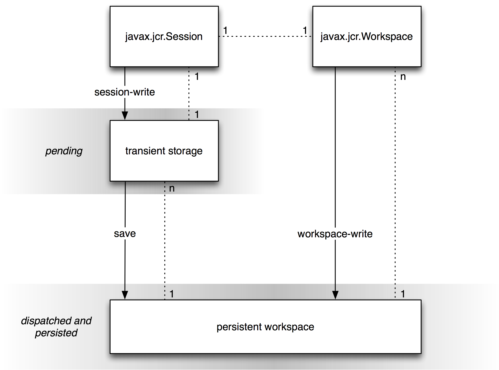
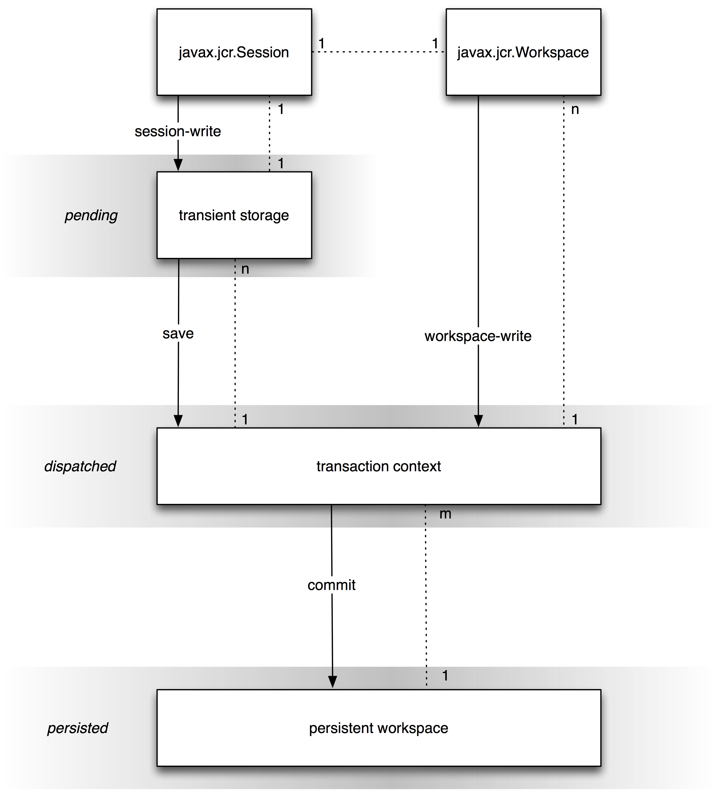

=====================================================================
JCR 2.0: 10 Writing (Content Repository for Java Technology API v2.0)
=====================================================================

10 Writing
==========

A repository may be *writable*.

Whether an implementation supports writing can be determined by querying
the repository descriptor table with

Repository.WRITE\_SUPPORTED.

A return value of true indicates support (see §24.2 *Repository
Descriptors*).

10.1 Types of Write Methods
---------------------------

A JCR write method is either a *session-write* or a *workspace-write*.

10.1.1 Session-Write
~~~~~~~~~~~~~~~~~~~~

Changes made through a session-write are buffered in a transient store
associated with that method's current session (see §3.1.8.2 *Current
Session and Workspace*). The transient store permits a series of changes
to be made without validation at every step, thus allowing item
structures to be temporarily invalid while they are being constructed.
Once completed, the change set can be *saved*.

-  Before save, a change in transient store is *pending*.

-  Upon save, all changes in transient store are *dispatched*.

10.1.2 Workspace-Write
~~~~~~~~~~~~~~~~~~~~~~

-  A change made through a workspace-write is immediately *dispatched*.

10.1.3 Transactions
~~~~~~~~~~~~~~~~~~~

-  In the absence of a transaction, every *dispatched* change is
   immediately *persisted*.

-  Within a transaction, dispatched changes are persisted upon *commit*.

(see §21 *Transactions*).

10.1.4 Visibility of Changes
~~~~~~~~~~~~~~~~~~~~~~~~~~~~

A change that is *pending* or *dispatched* (but not *persisted*) is
visible only to the session through which that change was made. A change
that is *persisted* is visible to all other sessions bound to the same
persistent workspace that have sufficient read permission.

10.1.5 Write Methods
~~~~~~~~~~~~~~~~~~~~

The write API is divided into the two types as follows.

10.1.5.1 Session-Write
^^^^^^^^^^^^^^^^^^^^^^

The session-write methods are

-  Node.addNode, setProperty and orderBefore.

-  Property.setValue.

-  Item.remove.

-  Node.removeShare, and removeSharedSet.

-  Session.move, removeItem and importXML.

-  Query.storeAsNode.

-  Node.setPrimaryType, addMixin and removeMixin.

-  RetentionManager.addHold, removeHold, setRetentionPolicy and
   removeRetentionPolicy.

-  AccessControlManager.setPolicy and removePolicy.

10.1.5.2 Workspace-Write Methods
^^^^^^^^^^^^^^^^^^^^^^^^^^^^^^^^

The workspace-write methods are:

-  Workspace.move, copy, clone, restore and importXML.

-  VersionManager.checkin, checkout, checkpoint, restore,
   restoreByLabel, merge, cancelMerge, doneMerge, createActivity ,
   removeActivity and createConfiguration.

-  Node.update and followLifecycleTransition.

-  LockManager.lock and unlock.

-  VersionHistory.addVersionLabel, removeVersionLabel and removeVersion.

-  Session.save.

-  Methods of org.xml.sax.ContentHandler acquired through
   Workspace.getContentHandler.

-  Workspace.createWorkspace and deleteWorkspace (these create or delete
   another workspace, though they do not affect *this* workspace).

10.1.5.3 Optional In-Content Side-Effects
^^^^^^^^^^^^^^^^^^^^^^^^^^^^^^^^^^^^^^^^^

Some repositories may choose to expose internal state data as virtual
content within a workspace. For example, the set of registered node
types may be so exposed.

In such cases, methods which directly affect the exposed internal state
and, as a side effect, change virtual content must do so in a
workspace-write manner. For example, NodeTypeManager.registerNodeType
and unregisterNodeType should immediately dispatch changes to the
in-content node type representation.

10.2 Core Write Methods
-----------------------

The *core write methods* of JCR are those write methods of the API whose
write effect is *not* incidental to the support of another feature, such
as versioning, import, locking, and so forth. Both session-write and
workspace-write methods are among the core write methods. The core write
methods are:

-  Node.addNode, setProperty and orderBefore.

-  Property.setValue.

-  Item.remove.

-  Node.removeShare, and removeSharedSet.

-  Session.move, and removeItem.

-  Workspace.move, copy, clone.

-  Session.save.

10.3 Session and Workspace Objects
----------------------------------

Given the set *S*\ :sub:`*0*`\ *..S*\ :sub:`*n*` of Session objects
bound to a persistent workspace *W*\ :sup:`*P*`, for each
*S*\ :sub:`*i*`, there exists a distinct Workspace object
*W*\ :sub:`*i*`\ *,* bound one-to-one to *S*\ :sub:`*i*`, that
represents the *view* of *W*\ :sup:`*P*` through the access permissions
of *S*\ :sub:`*i*`.

Despite their one-to-one correspondence, Session and Workspace are
defined as separate objects in order to differentiate the behavior of
session-write methods from the behavior of workspace-write methods.

10.3.1 Writing Without a Transaction
~~~~~~~~~~~~~~~~~~~~~~~~~~~~~~~~~~~~

The following diagram depicts the behavior of write methods *without a
transaction*.

| |image0|

10.3.2 Writing Within a Transaction
~~~~~~~~~~~~~~~~~~~~~~~~~~~~~~~~~~~

The following diagrams depicts the behavior of write methods *within a
transaction*.

| |image1|

10.4 Adding Nodes and Setting Properties
----------------------------------------

This section covers the JCR API methods for adding new nodes and
properties and changing the values of existing properties.

10.4.1 Adding a Node
~~~~~~~~~~~~~~~~~~~~

The methods

Node Node.addNode(String relPath, String primaryNodeTypeName)

and

Node Node.addNode(String relPath)

add a node at the specified location relative to this Node. The former
specifies the intended primary node type of the node, while the latter
assumes that the repository can determine the intended type from the
node type of the parent.

Node.addNode is a *session-write* method and therefore requires a
Session.save to dispatch the change (see §10.11 *Saving*).

10.4.2 Setting a Property
~~~~~~~~~~~~~~~~~~~~~~~~~

The generic method for setting a property is

Property Node.setProperty(String name, Value value, int type).

This method sets the property of this Node with the specified name to
the specified value and the specified type, converting the given value
to that type if necessary. If the property already exists its value is
changed. If it does not exist, it is added.

Node.setProperty is a *session-write* method and therefore requires a
Session.save to dispatch the change (see §10.11 *Saving*).

10.4.2.1 Changing Existing Properties
^^^^^^^^^^^^^^^^^^^^^^^^^^^^^^^^^^^^^

An existing property can also be changed with

void Property.setValue(Value value).

Property.setValue is a *session-write* method and therefore requires a
Session.save to dispatch the change (see §10.11 *Saving*).

10.4.2.2 Type-Specific Signatures
^^^^^^^^^^^^^^^^^^^^^^^^^^^^^^^^^

Signatures of Node.setProperty and Property.setValue are also provided
in which the intended JCR type is implied by the Java type passed in.
For example,

Node.setProperty(String name, Calendar value)

sets a JCR DATE property called name to the specified value. See the
Javadoc for the full set of signatures.

10.4.2.3 Setting a DECIMAL Property
^^^^^^^^^^^^^^^^^^^^^^^^^^^^^^^^^^^

When setting a property of type DECIMAL using

Node.setProperty(String name, BigDecimal value) or

Property.setValue(BigDecimal value)

the java.math.BigDecimal object passed must be an instance of the actual
class BigDecimal, not an instance of a subclass.

10.4.2.4 No Null Values
^^^^^^^^^^^^^^^^^^^^^^^

Every property must have a value. The range of property states does not
include having a “null value”, or “no value”. Setting a property to
“null” is equivalent to removing that property (see §10.9 *Removing
Nodes and Properties*).

10.4.2.5 Multi-value Properties and Null
^^^^^^^^^^^^^^^^^^^^^^^^^^^^^^^^^^^^^^^^

As with single-value properties, there is no such thing as a null value.
If a value within a multi-value property is set to null, this is
equivalent to removing that value from the value array. In such a case
the array is automatically compacted, shifting the indices of those
values with an index greater than that of the removed value by -1.
However, while no value within a multi-value property can be null, a
multi-value property can exist with no values (i.e., it can be an empty
array).

10.4.2.6 Setting Multi-value vs. Single-value Properties
^^^^^^^^^^^^^^^^^^^^^^^^^^^^^^^^^^^^^^^^^^^^^^^^^^^^^^^^

Multi-value and single-value properties are set using different
signatures of Node.setProperty and Property.setValue. Multi-value
properties must be set using the signatures that take either a Value[]
or String[]. Single-value properties must be set using the signatures
that take non-array value arguments. An attempt to set a multi-value
property with a non-array value argument, or a single-value property
with an array value argument, will throw a ValueFormatException.

10.4.3 Creating Value Objects
~~~~~~~~~~~~~~~~~~~~~~~~~~~~~

In many cases a property must be set using a Value object. Value objects
are created using a ValueFactory, acquired through

ValueFactory Session.getValueFactory().

The generic Value creation method is

Value ValueFactory.createValue(String value, int type)

which takes the string-form of the specified type and returns a Value of
that type using standard property type conversion (see §3.6.4 *Property
Type Conversion*).

10.4.3.1 Type-Specific Methods
^^^^^^^^^^^^^^^^^^^^^^^^^^^^^^

ValueFactory also provides methods for creating values of each property
type from the corresponding Java type. See the Javadoc for the full set
of signatures.

10.4.3.2 Creating a BINARY Value
^^^^^^^^^^^^^^^^^^^^^^^^^^^^^^^^

To create a BINARY value a javax.jcr.Binary object is first created from
a stream using

Binary ValueFactory.createBinary(InputStream stream)

and then passed to

Value ValueFactory.createValue(Binary value).

10.5 Selecting the Applicable Item Definition
---------------------------------------------

An addNode or setProperty method must determine which, if any, item
definitions of the parent node apply to the new child item, based on the
name of the new item and, if provided, its type.

If more than one item definition still applies even after taking the
name and type constraints into consideration, the repository may either
fail the add attempt or automatically select one of the item definitions
based on implementation-specific criteria.

For example, if the parent node P has two residual child node
definitions that differ only by their OPV value (see §3.7.2.5
*On-Parent-Version*), then even if both a name and a primary type are
supplied in the call to addNode this will not be sufficient information
to unambiguously determine which residual definition the new node should
fall under. In such a case, an implementation might automatically select
one of the definitions based on the implementation-specific rule that a
node with the name *X* will always have an OPV of *V* while other nodes
will have an OPV of *W*.

When Node.setProperty is used to change the value of an existing
property, cases where the intended property is ambiguous are handled in
the same way as when the method is used to create a new property.

10.6 Moving Nodes
-----------------

The method

void Session.move(String srcAbsPath, String destAbsPath)

moves the subgraph at srcAbsPath to a new location at destAbsPath. This
is a session-write operation (see §10.1.1 *Session-Write*). The method

void Workspace.move(String srcAbsPath, String destAbsPath)

does the same, but is a workspace-write operation (see §10.1.1
*Workspace-Write*).

10.6.1 Referenceable vs Non-Referenceable Nodes
~~~~~~~~~~~~~~~~~~~~~~~~~~~~~~~~~~~~~~~~~~~~~~~

A referenceable node is guaranteed to maintain the same identifier
across a move operation.

Non-referenceable nodes, on the other hand, *may* be tied either
partially or entirely (as in the case where the identifier equals the
path) to their position in the hierarchy and therefore may change
identifier upon move.

Though nothing prevents an implementation from making non-referenceable
node identifiers as stable as referenceable node identifiers, a user
cannot rely upon this across repository vendors. For an overview of how
identifiers behave with different methods see §25.1 *Treatment of
Identifiers.*

10.7 Copying Nodes
------------------

Nodes can be copied from one path location to another within a workspace
and, in repositories with more than one workspace, across workspaces
(see §3.10 *Multiple Workspaces and Corresponding Nodes*). A copy
operation on a node copies the node and its subgraph. Properties cannot
be copied individually.

10.7.1 Copying Within a Workspace
~~~~~~~~~~~~~~~~~~~~~~~~~~~~~~~~~

The method

void Workspace.copy(String srcAbsPath, String destAbsPath)

copies the node at srcAbsPath and its subgraph to a new location at
destAbsPath. This is a workspace-write operation (see §10.1.1
*Workspace-Write*).

10.7.2 Copying Across Workspaces
~~~~~~~~~~~~~~~~~~~~~~~~~~~~~~~~

In a repository with more than one workspace, the method

| void Workspace.copy(String srcWorkspace,
|  String srcAbsPath,
|  String destAbsPath)

copies the node at srcAbsPath in srcWorkspace and its subgraph to a new
location at destAbsPath in the current workspace. This is a
workspace-write operation (see §10.1.2 *Workspace-Write*).

10.7.3 Copying to an Empty Location
~~~~~~~~~~~~~~~~~~~~~~~~~~~~~~~~~~~

When a node N is copied to a path location where no node currently
exists, a new node N' is created at that location. The subgraph rooted
at and including N' (call it S') is created and is identical to the
subgraph rooted at and including N (call it S) with the following
exceptions:

-  If the copy is within the same workspace, every node in S' is given a
   new and distinct identifier. If the copy is to another workspace,
   every referenceable node in S' is given a new and distinct identifier
   while every non-referenceable node in S' *may* be given a new and
   distinct identifier (see §3.8 *Referenceable Nodes*).

-  The repository *may* automatically drop any *mixin node type* T
   present on any node M in S. Dropping a mixin node type in this
   context means that while M remains unchanged, its copy M' will lack
   the mixin T and any child nodes and properties defined by T that are
   present on M. For example, a node M that is mix:versionable may be
   copied such that the resulting node M' will be a copy of N except
   that M' will not be mix:versionable and will not have any of the
   properties defined by mix:versionable. In order for a mixin node type
   to be dropped it must be listed by name in the jcr:mixinTypes
   property of M. The resulting jcr:mixinTypes property of M' will
   reflect any change.

-  If a node M in S is referenceable and its mix:referenceable mixin is
   *not* dropped on copy, then the resulting jcr:uuid property of M'
   will reflect the new identifier assigned to M'.

-  Each REFERENCE or WEAKEREFERENCE property R in S is copied to its new
   location R' in S'\ *.* If R references a node M *within* S then the
   value of R' will be the identifier of M', the new copy of M, thus
   preserving the reference within the subgraph (see §3.8 *Referenceable
   Nodes*).

10.7.4 Copying to an Existing Node
~~~~~~~~~~~~~~~~~~~~~~~~~~~~~~~~~~

When a node N is copied to a location where a node N' already exists the
repository may either immediately throw an ItemExistsException *or*
attempt to update the node N' by selectively replacing part of its
subgraph with a copy of the relevant part of the subgraph of N. If the
node types of N and N' are compatible, the implementation supports
update-on-copy for these node types and no other errors occur, then the
copy will succeed. Otherwise an ItemExistsException is thrown.

Which node types can be updated on copy and the details of any such
updates are implementation-dependent. For example, some implementations
may support update-on-copy for mix:versionable nodes. In such a case the
versioning-related properties of the target node would remain unchanged
(jcr:uuid, jcr:versionHistory, etc.) while the substantive content part
of the subgraph would be replaced with that of the source node.

10.8 Cloning and Updating Nodes
-------------------------------

A node can be *cloned* to another workspaces to create a new
corresponding node (see §3.10 *Corresponding Nodes*)

10.8.1 Cloning Nodes Across Workspaces
~~~~~~~~~~~~~~~~~~~~~~~~~~~~~~~~~~~~~~

Corresponding nodes can be created by *cloning* a node from one
workspace to another using:

| void Workspace.clone(String srcWorkspace,
|  String srcAbsPath,
|  String destAbsPath,
|  boolean removeExisting)

This method clones the subgraph at srcAbsPath in srcWorkspace to
destAbsPath in this workspace. The clone method clones both
referenceable and non-referenceable nodes and preserves the identifier
of every node in the source subgraph.

If there already exists anywhere in this workspace a node with the same
identifier as an incoming node from srcWorkspace, and removeExisting is
false, then clone will throw an ItemExistsException.

If removeExisting is true then the existing node is removed from its
current location and the cloned node with the same identifier from
srcWorkspace is copied to this workspace as part of the copied subgraph
(that is, not into the former location of the old node). The subgraph of
the cloned node will reflect the state of the clone in srcWorkspace, in
other words the existing node will be moved *and* changed. If the
existing node cannot be moved and changed because of node type
constraints, access control constraints or because its parent is
checked-in (or its parent is non-versionable but its nearest versionable
ancestor is checked-in), then the appropriate exception is thrown
(ConstraintViolationException, AccessControlException or
VersionException, respectively).

In the case of shareable nodes, it is possible to clone a node into its
own workspace (see §14.1 *Creation of Shared Nodes*).

10.8.2 Getting a Corresponding Node
~~~~~~~~~~~~~~~~~~~~~~~~~~~~~~~~~~~

Finding the path of a node's corresponding node in another workspace is
done with

String Node.getCorrespondingNodePath(String workspaceName).

This method returns the absolute path of the node in the specified
workspace that corresponds to this node.

10.8.3 Updating Nodes Across Workspaces
~~~~~~~~~~~~~~~~~~~~~~~~~~~~~~~~~~~~~~~

Node correspondence governs the behavior of the update method:

void Node.update(String srcWorkspace)

causes this node to be updated to reflect the state of its corresponding
node in srcWorkspace.

If this node does have a corresponding node in the workspace
srcWorkspace, then this replaces this node and its subgraph with a clone
of the corresponding node and its subgraph.

If this node does not have a corresponding node in srcWorkspace, then
the method has no effect.

If the update succeeds, the changes made to this node and its subgraph
are applied to the workspace immediately, there is no need to call save.

The update method does not respect the checked-in status of nodes. An
update may change a node even if it is currently checked-in.

Node.update works for both versionable and non-versionable nodes (see
§3.13 *Versioning Model*)

10.9 Removing Nodes and Properties
----------------------------------

Removing a node or property can be done with

void Item.remove()

On the item to be removed itself, or

void Session.removeItem(String absPath)

Where absPath specifies the item to be removed.

These methods are session-write and therefore require a Session.save to
dispatch the change.

10.9.1 Setting a Property to Null
~~~~~~~~~~~~~~~~~~~~~~~~~~~~~~~~~

A property can also be removed by setting its value to null. When this
is done, the null parameter must be cast to a non-array type for
single-value properties and an array type for multi-value properties.

Note that setting a multi-value property to an array containing null
values is different from setting it to a null cast to an array type. In
the former case, all null values within the array are removed and the
array is compacted to include only non-null values even if this results
in a multi-value property being set to an empty array. In the latter
case the entire property is removed. For example,

p.setValue((String[])null)

would remove property p, whereas

p.setValue(new String[]{“a”, null, “b”})

would set p to [“a”,”b”] and

p.setValue(new String[]{null})

would set p to the empty array, [] (see §10.4.2.4 *No Null Values*).

10.9.1.1 Removing a REFERENCE Target
^^^^^^^^^^^^^^^^^^^^^^^^^^^^^^^^^^^^

To remove a node that is the target of a REFERENCE property, one must
first remove that REFERENCE property (with the exception of REFERENCE
properties within the frozen node of a version, see §3.13.4.6
*References in a Frozen Node*).

The check for referential integrity is done *on persist* of the removal.
If the subgraph to be removed contains a node that is the target of a
REFERENCE property outside that subgraph, a
ReferentialIntegrityException is thrown.

10.10 Node Type Assignment
--------------------------

Most writable repository implementations will support assignment of
primary and mixin node types on node creation. Some implementations may
also support assignment of new primary or mixin node types to existing
nodes.

10.10.1 Node Type Assignment Behavior
~~~~~~~~~~~~~~~~~~~~~~~~~~~~~~~~~~~~~

On Node.addNode the primary node type of the new node is assigned. In
cases where a Node.addNode does not explicitly specify a primary node
type, it is determined by the applicable child node definition (see
§3.7.7 *Applicable Item Definition*). Otherwise, it is determined by the
node type name passed. The jcr:primaryType property is created
immediately and set to the name of the primary node type. This property
is defined as mandatory in the node type nt:base (see §3.7.10 *Base
Primary Node Type*) and will therefore appear on every node.

The constraints enforced by the assigned node type may take effect
immediately, or on persist. Whichever is chosen, this *node* *type
assignment behavior* must be consistent across all methods that assign
node types (Node.setPrimaryType, Node.addMixin and Node.removeMixin, see
§10.10.2 *Updating a Node's Primary Type* and §10.10.3 *Assigning Mixin
Node Types*).

If *immediate effect* is implemented then conflicts with other mixins or
with the primary type are detected immediately and an exception thrown.
If *on-persist effect* is implemented, such conflicts are detected and
the appropriate exception thrown on persist. This validation can also be
performed pre-emptively with

boolean Node.canAddMixin(String mixinName).

10.10.2 Updating a Node's Primary Type
~~~~~~~~~~~~~~~~~~~~~~~~~~~~~~~~~~~~~~

A repository *may* permit the primary type of a node to be changed
during its lifetime. Repositories are free to limit the scope of
permitted changes both in terms of which nodes may be changed and which
changes are allowed.

The method for changing the primary type of a particular node is

void Node.setPrimaryType(String nodeTypeName).

This method changes the primary node type of the node to nodeTypeName,
and immediately changes the jcr:primaryType property of the node
appropriately.

Semantically, the new node type takes effect in accordance with the
*node type assignment behavior* of the repository (see §10.10.1 *Node
Type Assignment Behavior*).

10.10.3 Assigning Mixin Node Types
~~~~~~~~~~~~~~~~~~~~~~~~~~~~~~~~~~

In addition to its single primary node type, a node may have one or more
mixin node types assigned to it (see §3.7.5 *Mixin Node Types*).
Assignment of mixin types is done through

void Node.addMixin(String mixinName).

A repository that supports the assignment of mixin types may permit
mixin addition only before the first save of a node (in effect, only on
node creation) or it may permit mixin addition and removal during the
lifetime of a node. Removal of mixin node types is done with

void Node.removeMixin(String mixinName).

10.10.3.1 jcr:mixinTypes
^^^^^^^^^^^^^^^^^^^^^^^^

When a new mixin type is assigned using Node.addMixin, the name of the
mixin is added immediately to the multi-valued jcr:mixinTypes property.
If the property does not exist, it is created. This property is defined
as non-mandatory in the node type nt:base and therefore may appear on
any node. When a mixin is removed with Node.removeMixin the name of the
mixin type is immediately removed from the property.

Semantically, any changes to mixin node types take effect in accordance
with the *node type assignment behavior* of the repository (see §10.10.1
*Node Type Assignment Behavior*).

10.10.3.2 Pre-emptive Node Type Validation
^^^^^^^^^^^^^^^^^^^^^^^^^^^^^^^^^^^^^^^^^^

A NodeType object can be queried to pre-emptively determine whether a
particular child item's addition or removal is allowed by that node
type. The methods are:

| boolean NodeType.canSetProperty(String propertyName,
|  Value value)

| boolean NodeType.canSetProperty(String propertyName,
|  Value[] values)

boolean NodeType.canAddChildNode(String childNodeName)

| boolean NodeType.canAddChildNode(String childNodeName,
|  String nodeTypeName)

boolean NodeType.canRemoveNode(String nodeName)

boolean NodeType.canRemoveProperty(String propertyName)

10.10.3.3 Automatic Addition and Removal of Mixins
^^^^^^^^^^^^^^^^^^^^^^^^^^^^^^^^^^^^^^^^^^^^^^^^^^

A repository may automatically assign a mixin type to a node upon
creation. For example if, as a matter of configuration, all nt:file
nodes in a repository are to be versionable, then the repository may
automatically assign the mixin type mix:versionable to each such node as
it is created.

Similarly, a repository may automatically strip incoming imported nodes
of any mixin node types that the repository does not support (see §11.3
*Respecting Property Semantics*).

Note that this behavior is distinct from that of adding a mixin type as
a supertype of some primary types in the node type inheritance hierarchy
(see §3.7.16.1.2 *Additions to the Hierarchy*). Though the two features
may both be employed in the same repository, they differ in that one
affects the actual hierarchy of the supported node types, while the
other works on a node-by-node basis.

10.11 Saving
------------

When a change is made to an item through a session-write method bound to
a session *S*, that change is immediately visible through all subsequent
read method calls through *S*. When

void Session.save()

is performed on *S*, all pending changes recorded in *S* are dispatched.
Without transactions this causes the changes to be persisted. Within a
transaction the changes must first be committed in order to be
persisted. When a change is persisted it becomes visible to other
sessions bound to the same persistent workspace.

From the point of view of a session *S*, the apparent state of an Item
bound to *S* does not change upon a save of *S* (apart from the values
returned by isNew or isModified, see §10.11.3 *Item Status*) since that
state will have been visible *to S* since the session-write method call
that caused it.

If one or more of the pending changes cause an exception to be thrown on
save, then *no* pending changes are dispatched and the set of pending
changes recorded on the session is left unaffected.

10.11.1 Refresh
~~~~~~~~~~~~~~~

The method

void Session.refresh(boolean keepChanges)

refreshes the state of the transient session store.

If keepChanges is false, all pending changes in the session are
discarded and all items bound to that session revert to their current
dispatched state. Without transactions, this is the current persisted
state. Within a transaction, this state will reflect persistent storage
as modified by changes that have been saved but not yet committed.

If keepChanges is true then pending changes are not discarded but items
that do not have changes pending have their state refreshed to reflect
the current persisted state, thus revealing changes made by other
sessions.

If an exception occurs on refresh, the set of all pending changes
recorded on the session is left unaffected and the state of all bound
Items is also unaffected.

10.11.2 Session Status
~~~~~~~~~~~~~~~~~~~~~~

The method

boolean Session.hasPendingChanges()

is used to determine if a session holds pending changes.

10.11.3 Item Status
~~~~~~~~~~~~~~~~~~~

Whether an Item has pending changes can be determined with

boolean Item.isModified().

Whether an Item constitutes part of the pending changes of its parent
can be determined with

boolean Item.isNew().

10.11.4 Persisting by Identifier
~~~~~~~~~~~~~~~~~~~~~~~~~~~~~~~~

When a change to an item is persisted, the item in the persistent
workspace to which that pending change is written is determined as
follows:

-  If the changed Item is a Node with identifier *I*, then the changes
   are written to the persistent node with identifier *I*.

-  If the changed Item is a Property named *P* of a Node with identifier
   *I*, then the change is written to the persistent property *P* of the
   persistent node with identifier *I*.

These principles apply to both referenceable and non-referenceable nodes
(see §3.8 *Referenceable Nodes*). For an overview of how identifiers
behave with different methods see §25.1 *Treatment of Identifiers*.

10.11.5 Timing of Validation
~~~~~~~~~~~~~~~~~~~~~~~~~~~~

For session-write methods, implementers have flexibility in deciding
whether a particular validation is to be performed immediately on
invocation of the write method or later on persist. For example, in the
case Node.addNode, an implementer might immediately check that the path
given is valid while postponing validation of node type constraints
until persist-time.

-  It is *suggested* that an implementation perform each validation as
   soon as possible, given the underlying design of the repository.

-  It is *required* that an implementation prohibit the emergence of a
   persistent state in violation of the validation rules defined by this
   specification.

10.11.6 Invalid States
~~~~~~~~~~~~~~~~~~~~~~

If an item has been modified in the Session but not yet persisted, and
its corresponding item in the persistent workspace is altered through a
workspace-write method, this has no effect on the transient state of the
Session. The altered item in the Session remains and may be persisted
later. However, the change made to the workspace *may* render the
attempt to persist the session-change invalid (for example, if the
workspace-change removed the parent of the session-change item). Note
that this is precisely the same situation as would arise if a change
were made to a workspace through *another* Session. In both cases the
persist of the change may throw an InvalidItemStateException.

10.11.7 Reflecting Item State
~~~~~~~~~~~~~~~~~~~~~~~~~~~~~

When changes are made to an Item object, those changes are recorded in
its bound Session and immediately reflected in the Item object itself. A
subsequent re-retrieval of the same item entity through a method bound
to the same Session, will return an Item object reflecting the recent
change. Note that this includes acquisition of nodes and properties
through standard getter methods such as getNode and also retrieval
through other means, such as a query (see §6 *Query*).

Whether the second Item object is the same actual Java object instance
as the first is an implementation issue. However, the state reflected by
the object must at all times be consistent with any other Item object
bound to the same Session that represents the same actual item entity.
The criteria of item identity in this context are those described in
§10.11.4 *Persisting by Identifier*.

10.11.8 Invalid Items
~~~~~~~~~~~~~~~~~~~~~

An Item object may become invalid for a number of reasons.

If Item.remove has been called on the item any subsequent calls to any
read or write methods or invocations of save or refresh on that Item,
from within the same Session, will throw an InvalidItemStateException.
Before the removal is saved it may be cancelled by a
Session.refresh(false). At this point the invalid Item object may become
valid again, or the repository may require a new Item object to be
acquired. Which approach is taken is a matter of implementation.

An InvalidItemStateException *may* be thrown immediately on a write
method of an Item if the change being made would, upon persist, conflict
with a change made and persisted through another Session. If detection
of the conflict is only possible at persist-time, then an
InvalidItemStateException will be thrown at that point. Whether a
conflict is detected when the change is made or on persist depends on
the implementation.

Apart from these specific cases, the validity of an Item must be as
stable as the *identifiers* used in the repository (see §3.3
*Identifiers*).

10.11.9 Seeing Changes Made by Other Sessions
~~~~~~~~~~~~~~~~~~~~~~~~~~~~~~~~~~~~~~~~~~~~~

Transient storage of pending changes in a Session may be implemented a
number of ways. A repository is free to use any approach as long as it
guarantees that two Item objects bound to the same Session will never
reflect conflicting state information.

10.12 Namespace Registration
----------------------------

A repository has a single namespace registry (see §3.5.1 *Namespace
Registry*) represented by the NamespaceRegistry object, acquired through

NamespaceRegistry Workspace.getNamespaceRegistry().

NamespaceRegistry allows for persistent changes to namespaces through
the following methods.

10.12.1 Registering a Namespace
~~~~~~~~~~~~~~~~~~~~~~~~~~~~~~~

| void NamespaceRegistry.
|  registerNamespace(String prefix, String uri)

sets a one-to-one mapping between prefix and uri in the global namespace
registry of this repository.

Assigning a new prefix to a URI that already exists in the namespace
registry erases the old prefix. Apart from the XML restriction (see
§10.9.3 *Namespace Restrictions*) this can almost always be done, though
an implementation is free to prevent particular remappings by throwing a
NamespaceException. Re-assigning an already registered prefix to a new
URI in effect unregisters its former URI.

10.12.2 Unregistering a Namespace
~~~~~~~~~~~~~~~~~~~~~~~~~~~~~~~~~

The method

void NamespaceRegistry.unregisterNamespace(String prefix)

removes a namespace mapping from the registry.

10.12.3 Namespace Restrictions
~~~~~~~~~~~~~~~~~~~~~~~~~~~~~~

The following restrictions apply to registering, re-registering and
unregistering namespaces:

-  To avoid conflicts with XML , attempting to register a prefix that
   begins with the characters “xml” (in any combination of case) will
   throw a NamespaceException.

-  Attempting to re-assign or unregister a built-in prefix (jcr, nt,
   mix, sv, xml, or the empty prefix) will throw a NamespaceException.

-  An attempt to unregister a namespace that is not currently registered
   will throw a NamespaceException.

-  An implementation may prevent the re-assignment or unregistration of
   any prefixes for implementation-specific reasons by throwing a
   NamespaceException.

10.12.4 Namespace Information
~~~~~~~~~~~~~~~~~~~~~~~~~~~~~

The following methods provide information about the state of the
registry:

String[] NamespaceRegistry.getPrefixes()

returns all currently registered prefixes.

String[] NamespaceRegistry.getURIs()

returns all currently registered URIs.

String NamespaceRegistry.getURI(String prefix)

returns the URI currently mapped to the given prefix.

String NamespaceRegistry.getPrefix(String uri)

returns the prefix currently mapped to the given uri.

10.12.4.1 Relationship to Session Namespace Mapping
^^^^^^^^^^^^^^^^^^^^^^^^^^^^^^^^^^^^^^^^^^^^^^^^^^^

The repository namespace registry serves as the default mapping and is
copied to a session's internal mapping table on session creation. The
mappings can then be changed independently of the registry within the
scope of that session. The methods shown here affect and report only the
state of the central registry. Existing local namespace mappings will
not be affected by changes to the persistent namespace registry.

